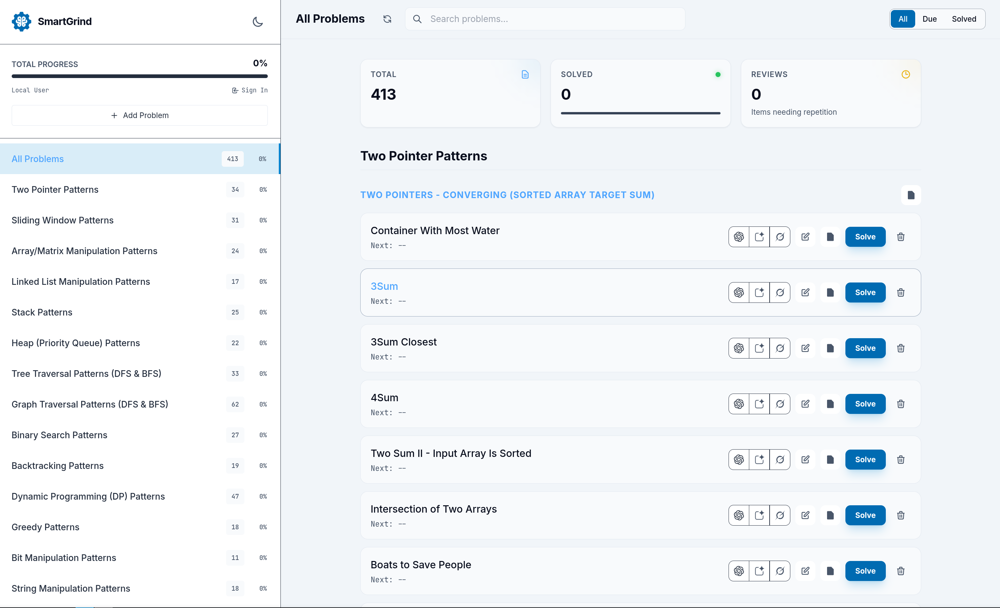
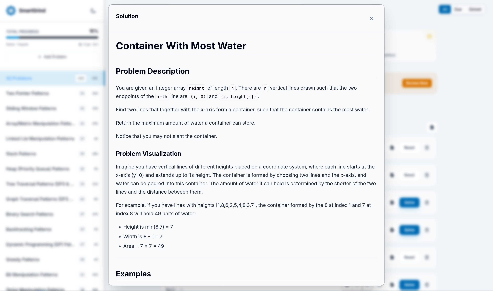
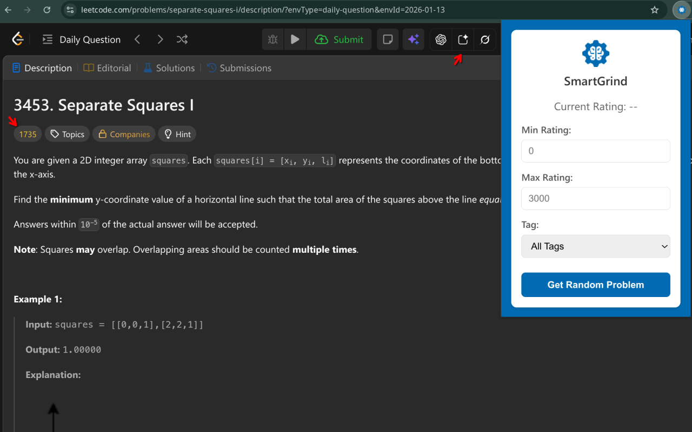
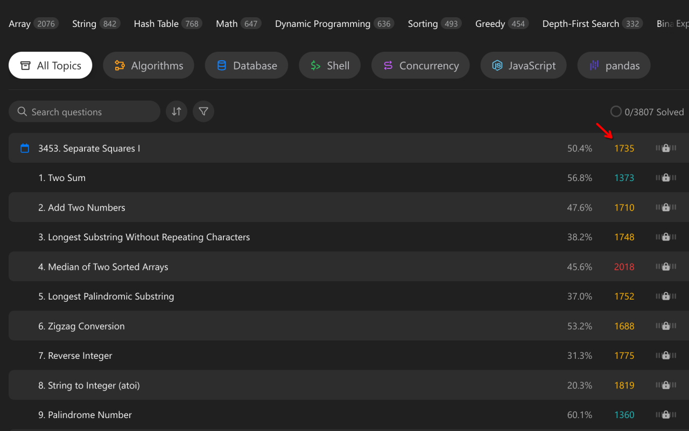

# Smart Grind

[](https://opensource.org/licenses/MIT)
[](https://algovyn.com/smartgrind)
[](https://chromewebstore.google.com/detail/smartgrind/eaolfkdmfnnanbfkaejnkcfafpankcmp)

> **Master coding interviews with intelligent pattern-based practice and spaced repetition.**

<p align="center">
  <a href="https://algovyn.com/smartgrind">🌐 Website</a> •
  <a href="https://chromewebstore.google.com/detail/smartgrind/eaolfkdmfnnanbfkaejnkcfafpankcmp">🧩 Chrome Extension</a> •
  <a href="#quick-start">🚀 Quick Start</a>
</p>

---

## 📸 Screenshots

### Web Application — Pattern-Based Learning

<table>
  <tr>
    <td width="50%">
      
      <p align="center"><b>Dashboard</b> — Browse 12+ algorithm patterns with progress tracking</p>
    </td>
    <td width="50%">
      
      <p align="center"><b>Problem View</b> — Detailed explanations with visualizations</p>
    </td>
  </tr>
</table>

### Chrome Extension — Enhanced LeetCode

<table>
  <tr>
    <td width="50%">
      
      <p align="center"><b>Popup</b> — Smart random problem picker with rating filters</p>
    </td>
    <td width="50%">
      
      <p align="center"><b>Problem View</b> — Numerical ratings (0–3000) on every problem</p>
    </td>
  </tr>
</table>

---

## ✨ Features

| | |
|:---|:---|
| 🎯 **Numerical Ratings** | 0–3000 scale instead of Easy/Medium/Hard |
| 🎲 **Smart Random Pick** | Filter by rating range and tags |
| 📚 **Pattern Library** | 12+ patterns: Two Pointers, Sliding Window, DP, etc. |
| 🔄 **Spaced Repetition** | Auto-scheduled reviews (1, 3, 7, 14, 30, 60 days) |
| 🤖 **AI Integration** | ChatGPT, Gemini, Grok for instant help |
| 📱 **Responsive** | Works on desktop and mobile |

---

## 🚀 Quick Start

### Chrome Extension

```bash
cd chrome-extension/
# Load unpacked in chrome://extensions/
```

Or [install from Chrome Web Store](https://chromewebstore.google.com/detail/smartgrind/eaolfkdmfnnanbfkaejnkcfafpankcmp).

### Web App

```bash
cd website/
npm install
cp wrangler.toml.example wrangler.toml
npm run dev
```

Deploy to Cloudflare: `npm run deploy`

---

## 📁 Project Structure

```
smart-grind/
├── chrome-extension/     # Chrome extension (Manifest V3)
│   ├── popup.html       # Extension UI
│   ├── content.js       # LeetCode page injection
│   └── screenshots/     # Extension screenshots
│
├── website/              # Web app (Cloudflare Pages)
│   ├── public/          # SPA & static assets
│   ├── functions/       # Cloudflare Workers API
│   └── screenshots/     # Web app screenshots
│
└── logo/                # Project logos
```

---

## 📖 Documentation

- [Chrome Extension README](chrome-extension/README.md)
- [Web App README](website/README.md)

---

## 🤝 Contributing

Contributions welcome! See individual README files for component-specific guidelines.

1. Fork the repository
2. Create a feature branch: `git checkout -b feature/amazing-feature`
3. Commit using conventional commits: `feat:`, `fix:`, `docs:`
4. Submit a pull request

---

## 📬 Support

- 🐛 [Open an issue](https://github.com/AlgoVyn/smart-grind/issues)
- 💬 [GitHub Discussions](https://github.com/AlgoVyn/smart-grind/discussions)
- 📧 [support@algovyn.com](mailto:support@algovyn.com)

---

<p align="center">
  <a href="https://github.com/AlgoVyn/smart-grind">
    
  </a>
</p>
