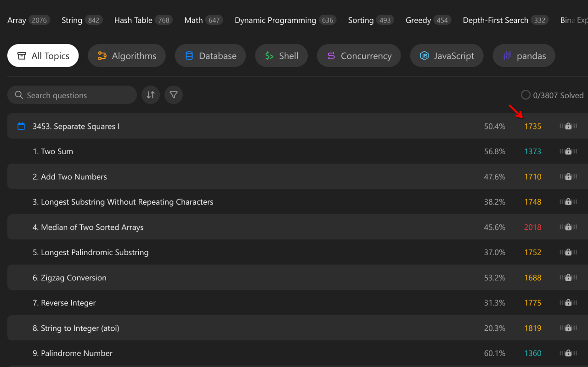

# Smart Grind — Chrome Extension 🧩

[](https://opensource.org/licenses/MIT)


**Smart Grind** is a Chrome extension that enhances your LeetCode practice with numerical problem ratings, smart problem selection, and AI-powered assistance.

<p align="center">
  <strong>📦 Install:</strong> <a href="https://chromewebstore.google.com/detail/smartgrind/eaolfkdmfnnanbfkaejnkcfafpankcmp">Chrome Web Store</a><br>
  <strong>🌐 Website:</strong> <a href="https://algovyn.com/smartgrind">algovyn.com/smartgrind</a>
</p>

---

## Table of Contents

- [Smart Grind — Chrome Extension 🧩](#smart-grind--chrome-extension-)
  - [Table of Contents](#table-of-contents)
  - [Features](#features)
    - [Core Functionality](#core-functionality)
    - [Advanced Features](#advanced-features)
    - [Technical Details](#technical-details)
  - [Screenshots](#screenshots)
  - [Installation](#installation)
    - [From Chrome Web Store](#from-chrome-web-store)
    - [From Source (Developers)](#from-source-developers)
  - [Usage](#usage)
    - [Getting Started](#getting-started)
    - [Popup Interface](#popup-interface)
    - [AI Assistance](#ai-assistance)
    - [Understanding Ratings](#understanding-ratings)
    - [Rating Calculation](#rating-calculation)
  - [Architecture](#architecture)
    - [Extension Components](#extension-components)
    - [Data Flow](#data-flow)
    - [Permissions](#permissions)
  - [Contributing](#contributing)
  - [License](#license)
  - [Support](#support)

---

## Features

### Core Functionality

| Feature | Description |
|---------|-------------|
| 📊 **Problem Ratings** | Numerical 0–3000 scale replacing Easy/Medium/Hard |
| 📈 **User Rating** | Your estimated LeetCode rating based on solved problems |
| 🎲 **Random Selection** | Browse random problems within rating ranges and tags |
| 🏷️ **Tag Filtering** | Filter by LeetCode tags (Array, DP, etc.) |

### Advanced Features

- ✅ **Progress Tracking** — Automatically tracks solved problems
- 💾 **Persistent Settings** — Remembers your preferences across sessions
- 🔄 **Cross-Page Support** — Works on problem pages, lists, and contests
- 🤖 **AI Assistance** — ChatGPT, Gemini, Grok for instant explanations

### Technical Details

| Aspect | Details |
|--------|---------|
| **Data Sources** | Community-sourced ratings, official LeetCode tags |
| **Storage** | Chrome sync and local storage |
| **Performance** | Lightweight, minimal page impact |
| **Manifest** | Version 3 (MV3) |

> 📄 See [DATA_FORMAT.md](DATA_FORMAT.md) for data format details.

---

## Screenshots

| Problem Page | Popup Interface |
|--------------|------------------|
|  |  |

---

## Installation

### From Chrome Web Store

1. Visit the [SmartGrind listing](https://chromewebstore.google.com/detail/smartgrind/eaolfkdmfnnanbfkaejnkcfafpankcmp)
2. Click **Add to Chrome**
3. Navigate to LeetCode — the extension activates automatically

### From Source (Developers)

```bash
# Clone the repository
git clone https://github.com/AlgoVyn/smart-grind.git

# Open Chrome and navigate to: chrome://extensions/
# Enable Developer mode (top-right corner)
# Click "Load unpacked" and select: smart-grind/chrome-extension/
```

---

## Usage

### Getting Started

1. ✅ **Install** — Load the extension in Chrome developer mode
2. 🌐 **Navigate** — Go to [leetcode.com](https://leetcode.com)
3. ⚡ **Activate** — Extension activates automatically on problem pages
4. 🎛️ **Access Controls** — Click the SmartGrind icon in toolbar

### Popup Interface

| Control | Description |
|---------|-------------|
| 📊 **Current Rating** | Your estimated rating based on solved problems |
| 🎚️ **Rating Range** | Set min/max bounds for random selection |
| 🏷️ **Tag Filter** | Select specific problem tags |
| 🎲 **Get Random** | Opens a random problem matching your criteria |

### AI Assistance

On problem pages, AI buttons appear in the top buttons area:

| Button | AI Service | Action |
|--------|------------|--------|
| 🤖 | **ChatGPT** | Opens with pre-filled explanation prompt |
| ✨ | **Gemini** | Opens Google AI Studio with prompt |
| 🚀 | **Grok** | Opens Grok AI with prompt |

> 💡 Hover over buttons to see tooltips; buttons change color on hover

### Understanding Ratings

| Rating Range | Difficulty Level |
|--------------|-------------------|
| 0–800 | 🔰 Beginner |
| 800–1200 | 🥉 Easy |
| 1200–1600 | 🥈 Medium |
| 1600–2000 | 🥇 Hard |
| 2000–2500 | 🔥 Expert |
| 2500–3000 | 👑 Master |

### Rating Calculation

Your rating uses **Exponential Moving Average (EMA)** with **Bayesian smoothing**:

1. **Recency Weighting** — Recent problems have higher influence
2. **EMA Calculation** — Alpha = 0.2 for smoothing
3. **Bayesian Smoothing** — For <100 solved problems, blends with global average
4. **Confidence Factor** — Smoothing decreases as you solve more

---

## Architecture

### Extension Components

```
┌─────────────────────────────────────────────────────────────┐
│                    SmartGrind Extension                     │
├─────────────────────────────────────────────────────────────┤
│  manifest.json (MV3)                                        │
│                                                             │
│  ┌──────────────┐    ┌──────────────┐    ┌──────────────┐ │
│  │  Content     │    │   Popup      │    │  Background  │ │
│  │  Script      │    │   (UI)       │    │  (Worker)    │ │
│  │              │    │              │    │              │ │
│  │  • Ratings   │    │  • Settings  │    │  • Storage   │ │
│  │  • AI btns   │    │  • Random    │    │  • Messages  │ │
│  └──────────────┘    └──────────────┘    └──────────────┘ │
│                                                             │
│  ┌──────────────┐    ┌──────────────┐                     │
│  │ ratings.txt  │    │   tags.txt    │                     │
│  │ (problem     │    │  (LeetCode    │                     │
│  │  ratings)    │    │   tags)       │                     │
│  └──────────────┘    └──────────────┘                     │
└─────────────────────────────────────────────────────────────┘
```

### Data Flow

```
┌──────────────┐     ┌─────────────────┐     ┌──────────────────┐
│  LeetCode    │────▶│  Content Script │────▶│  Ratings Display │
│  Page Load   │     │  (injects UI)   │     │  + AI Buttons    │
└──────────────┘     └─────────────────┘     └──────────────────┘
                              │
                              ▼
                       ┌──────────────┐
                       │   Popup UI   │
                       │  (settings)  │
                       └──────────────┘
                              │
                              ▼
                       ┌──────────────┐
                       │   Background │
                       │   (storage)  │
                       └──────────────┘
```

### Permissions

| Permission | Purpose |
|------------|---------|
| `activeTab` | Interact with LeetCode pages |
| `storage` | Cache data, store preferences |
| `tabs` | Open new tabs for random problems |

---

## Contributing

We welcome contributions! See the [main README](../README.md) for contribution guidelines.

```bash
# Fork and clone
git clone https://github.com/YOUR-USERNAME/smart-grind.git

# Load as unpacked extension
# chrome://extensions/ → Load unpacked → chrome-extension/

# Make changes and test on LeetCode

# Submit PR
```

---

## License

Licensed under the [MIT License](LICENSE).

---

## Support

| Need | Contact |
|------|---------|
| 🐛 **Bug Report** | [Open an Issue](https://github.com/AlgoVyn/smart-grind/issues) |
| 💬 **Questions** | [GitHub Discussions](https://github.com/AlgoVyn/smart-grind/discussions) |
| 🌐 **Website** | [algovyn.com/smartgrind](https://algovyn.com/smartgrind) |

---

<div align="center">

**Happy grinding! 🚀**

[](https://github.com/AlgoVyn)

</div>

