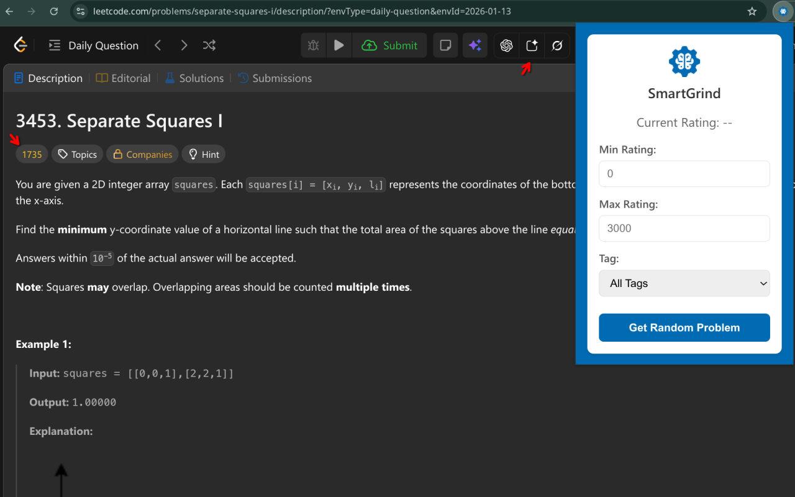

# Smart Grind - Chrome Extension 🧩

[](https://opensource.org/licenses/MIT)


**Smart Grind** is a Chrome extension designed to help you grind LeetCode and other coding problems optimally. It enhances your problem-solving experience by injecting smart features directly into supported platforms like LeetCode, including AI-powered assistance for problem explanations.

📦 **Install from Chrome Web Store**: [SmartGrind Chrome Extension](https://chromewebstore.google.com/detail/smartgrind/eaolfkdmfnnanbfkaejnkcfafpankcmp)

🌐 **Official Website**: [algovyn.com/smartgrind](https://algovyn.com/smartgrind)

---

## Table of Contents

- [Smart Grind - Chrome Extension 🧩](#smart-grind---chrome-extension-)
  - [Table of Contents](#table-of-contents)
  - [Features](#features)
    - [Core Functionality](#core-functionality)
    - [Advanced Features](#advanced-features)
    - [Technical Details](#technical-details)
  - [Screenshots](#screenshots)
  - [Installation](#installation)
    - [From Chrome Web Store](#from-chrome-web-store)
    - [From Source (Recommended for Developers)](#from-source-recommended-for-developers)
  - [Usage](#usage)
    - [Getting Started](#getting-started)
    - [Using the Popup Interface](#using-the-popup-interface)
    - [Using AI Assistance](#using-ai-assistance)
    - [Understanding Ratings](#understanding-ratings)
    - [Rating Calculation Method](#rating-calculation-method)
    - [Tips for Effective Use](#tips-for-effective-use)
    - [Troubleshooting](#troubleshooting)
  - [Architecture](#architecture)
    - [Extension Components](#extension-components)
    - [Data Flow](#data-flow)
    - [Permissions](#permissions)
  - [Contributing](#contributing)
    - [Development Setup](#development-setup)
  - [License](#license)
  - [Support](#support)

---

## Features

### Core Functionality

| Feature | Description |
|---------|-------------|
| 📊 **Problem Ratings Display** | Replaces "Easy/Medium/Hard" with numerical ratings (0-3000) |
| 📈 **User Rating Estimation** | Calculates your estimated LeetCode rating |
| 🎲 **Random Problem Selection** | Browse random problems within rating ranges and tags |
| 🏷️ **Tag-Based Filtering** | Filter by LeetCode tags (Array, DP, etc.) |

### Advanced Features

- ✅ **Progress Tracking** - Automatically tracks solved problems by monitoring submission status
- 💾 **Persistent Settings** - Remembers your preferred rating ranges and tag filters
- 🔄 **Cross-Page Support** - Works on problem pages, lists, and contest pages
- 🤖 **AI Assistance** - Quick access to ChatGPT, AI Studio, Grok for explanations

### Technical Details

| Aspect | Details |
|--------|---------|
| **Data Sources** | Community-sourced problem ratings, official LeetCode tags |
| **Storage** | Chrome's sync and local storage |
| **Performance** | Lightweight, minimal page load impact |
| **Manifest** | Version 3 (MV3) |

> 📄 For detailed information about data formats and sources, see [DATA_FORMAT.md](DATA_FORMAT.md).

---

## Screenshots

| Problem Page with Ratings | Popup Interface |
|---------------------------|-----------------|
|  |  |

---

## Installation

### From Chrome Web Store

1. Visit the [SmartGrind listing](https://chromewebstore.google.com/detail/smartgrind/eaolfkdmfnnanbfkaejnkcfafpankcmp)
2. Click **Add to Chrome**
3. Navigate to LeetCode and enjoy enhanced features!

### From Source (Recommended for Developers)

```bash
# 1. Clone the repository
git clone https://github.com/AlgoVyn/smart-grind.git

# 2. Open Google Chrome
#    Navigate to: chrome://extensions/

# 3. Enable Developer mode
#    (toggle in top-right corner)

# 4. Click "Load unpacked"
#    Select the smart-grind/chrome-extension folder

# 5. Visit LeetCode to see enhanced displays!
```

---

## Usage

### Getting Started

1. ✅ **Install** - Load the extension in Chrome developer mode
2. 🌐 **Navigate** - Go to [leetcode.com](https://leetcode.com)
3. ⚡ **Activate** - Extension activates automatically on problem pages
4. 🎛️ **Access Controls** - Click the SmartGrind icon in toolbar

### Using the Popup Interface

| Control | Description |
|---------|-------------|
| 📊 **Current Rating** | View your estimated rating based on solved problems |
| 🎚️ **Rating Range** | Set min/max rating bounds for random selection |
| 🏷️ **Tag Filter** | Select specific problem tags |
| 🎲 **Get Random Problem** | Opens a random problem matching criteria |

### Using AI Assistance

On problem pages, AI buttons appear in the top buttons area:

| Button | AI Service | Action |
|--------|------------|--------|
| 🤖 | **ChatGPT** | Opens with pre-filled problem explanation prompt |
| ✨ | **AI Studio (Gemini)** | Opens Google AI Studio with prompt |
| 🚀 | **Grok** | Opens Grok AI with prompt |

> 💡 Hover over buttons to see tooltips; buttons change color on hover

### Understanding Ratings

| Rating Range | Difficulty |
|--------------|------------|
| 0-800 | 🔰 Beginner |
| 800-1200 | 🥉 Easy |
| 1200-1600 | 🥈 Medium |
| 1600-2000 | 🥇 Hard |
| 2000-2500 | 🔥 Expert |
| 2500-3000 | 👑 Master |

### Rating Calculation Method

Your rating uses **Exponentially Weighted Moving Average (EMA)** with **Bayesian smoothing**:

```
1. Recency Weighting → Recent problems have higher influence
2. EMA Calculation → Alpha = 0.2 for smoothing
3. Bayesian Smoothing → For <100 solved problems, blends with global average
4. Confidence Factor → Smoothing decreases as you solve more
```

### Tips for Effective Use

| Tip | Why |
|-----|-----|
| 📌 **Pin the Extension** | Quick access from toolbar |
| 🔐 **Grant Permissions** | Ensure activeTab for full functionality |
| 📅 **Regular Practice** | Use random selection for consistent practice |
| 📈 **Track Progress** | Monitor rating improvement over time |

### Troubleshooting

| Issue | Solution |
|-------|----------|
| ❌ Ratings Not Showing | Ensure you're on a LeetCode problem page |
| ❌ Popup Not Working | Check extension is enabled and permissions granted |
| ❌ Data Not Loading | Clear browser cache and reload extension |

---

## Architecture

### Extension Components

```
┌─────────────────────────────────────────────┐
│           SmartGrind Extension               │
├─────────────────────────────────────────────┤
│  manifest.json                              │
│  ├── Content Script (content.js)            │
│  │   ├── Injects rating displays            │
│  │   └── Adds AI buttons                    │
│  ├── Popup (popup.html + popup.js)          │
│  │   ├── Settings UI                        │
│  │   └── Random problem selector            │
│  ├── Background (background.js)             │
│  │   ├── Service worker                     │
│  │   └── Message passing                    │
│  └── Data Files                             │
│      ├── ratings.txt                        │
│      └── tags.txt                           │
└─────────────────────────────────────────────┘
```

### Data Flow

```
┌──────────────┐     ┌─────────────────┐     ┌──────────────────┐
│  Page Load   │────▶│ Content Script  │────▶│  Ratings Display │
│              │     │ (injects UI)    │     │  + AI Buttons    │
└──────────────┘     └─────────────────┘     └──────────────────┘
                              │
                              ▼
                       ┌──────────────┐
                       │   Popup UI   │
                       │ (settings)   │
                       └──────────────┘
                              │
                              ▼
                       ┌──────────────┐
                       │   Background │
                       │   (storage)  │
                       └──────────────┘
```

### Permissions

| Permission | Purpose |
|------------|---------|
| `activeTab` | Interact with LeetCode pages |
| `storage` | Cache data, store preferences |
| `tabs` | Open new tabs for random problems |

---

## Contributing

We welcome contributions! 🎉

| Contribution Type | How to Help |
|-------------------|-------------|
| 🐛 **Bug Reports** | Open issues for bugs |
| 💡 **Feature Requests** | Suggest new functionality |
| 🔧 **Code Contributions** | Submit pull requests |

### Development Setup

```bash
# 1. Fork and clone
git clone https://github.com/YOUR-USERNAME/smart-grind.git

# 2. Load as unpacked extension
#    chrome://extensions/ → Load unpacked

# 3. Make changes to source files

# 4. Test on LeetCode

# 5. Submit PR
```

Please follow the standard GitHub flow: **fork → branch → commit → PR**

---

## License

This project is licensed under the [MIT License](LICENSE) - see the LICENSE file for details.

---

## Support

| Need | Contact |
|------|---------|
| 🐛 **Bug Report** | [Open an Issue](https://github.com/AlgoVyn/smart-grind/issues) |
| 💬 **General Questions** | [GitHub Discussions](https://github.com/AlgoVyn/smart-grind/discussions) |
| 🌐 **Website** | [algovyn.com/smartgrind](https://algovyn.com/smartgrind) |

---

<div align="center">

**Happy grinding! 🚀**

[](https://github.com/AlgoVyn)

</div>

