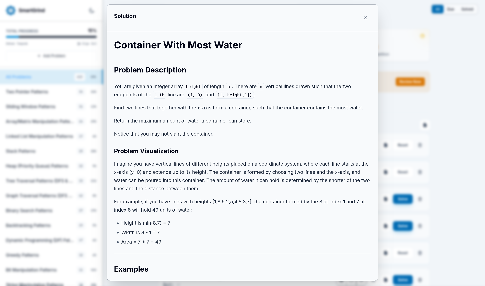

# Smart Grind - Pattern Practice Web App 🌐

[](https://opensource.org/licenses/MIT)


**Smart Grind** is a comprehensive web application designed to help you master coding patterns through structured practice and spaced repetition. It complements the Chrome extension by providing a complete platform for tracking progress across various algorithmic patterns.

📦 **Live Demo**: [algovyn.com/smartgrind](https://algovyn.com/smartgrind)

📦 **Chrome Extension**: [SmartGrind Extension](https://chromewebstore.google.com/detail/smartgrind/eaolfkdmfnnanbfkaejnkcfafpankcmp)

---

## Table of Contents

- [Smart Grind - Pattern Practice Web App 🌐](#smart-grind---pattern-practice-web-app-)
  - [Table of Contents](#table-of-contents)
  - [Features](#features)
    - [Core Functionality](#core-functionality)
    - [Advanced Features](#advanced-features)
    - [Technical Details](#technical-details)
  - [Screenshots](#screenshots)
  - [Why Smart Grind?](#why-smart-grind)
    - [Benefits at a Glance](#benefits-at-a-glance)
  - [Installation \& Setup](#installation--setup)
    - [Prerequisites](#prerequisites)
    - [Local Development](#local-development)
    - [Environment Configuration](#environment-configuration)
  - [Testing](#testing)
    - [Unit Tests](#unit-tests)
    - [End-to-End Tests](#end-to-end-tests)
    - [Test Structure](#test-structure)
  - [Usage](#usage)
    - [Getting Started](#getting-started)
    - [Navigation](#navigation)
    - [Problem Management](#problem-management)
    - [AI Assistance](#ai-assistance)
    - [Additional Features](#additional-features)
    - [Data Export/Import](#data-exportimport)
      - [Export Format](#export-format)
      - [Import](#import)
  - [Architecture](#architecture)
    - [Frontend Structure](#frontend-structure)
    - [Backend (Cloudflare Workers)](#backend-cloudflare-workers)
    - [Data Flow](#data-flow)
    - [Key Components](#key-components)
  - [API Reference](#api-reference)
    - [Authentication Endpoints](#authentication-endpoints)
      - [GET /api/auth?action=login](#get-apiauthactionlogin)
      - [GET /api/auth (callback)](#get-apiauth-callback)
    - [User Data Endpoints](#user-data-endpoints)
      - [GET /api/user](#get-apiuser)
      - [POST /api/user](#post-apiuser)
  - [Contributing](#contributing)
    - [Development Workflow](#development-workflow)
    - [Code Style](#code-style)
    - [Commit Message Guidelines](#commit-message-guidelines)
    - [Pull Request Guidelines](#pull-request-guidelines)
    - [Adding New Patterns](#adding-new-patterns)
    - [Reporting Issues](#reporting-issues)
  - [Troubleshooting](#troubleshooting)
    - [Debug Mode](#debug-mode)
  - [License](#license)
  - [Support](#support)

---

## Features

### Core Functionality

| Feature | Description |
|---------|-------------|
| 📚 **Pattern-Based Learning** | Problems organized by algorithmic patterns |
| 🔄 **Spaced Repetition** | Review intervals: 1, 3, 7, 14, 30, 60 days |
| 📊 **Progress Tracking** | Visual bars and statistics per pattern |
| ➕ **Custom Problems** | Add your own practice problems |

### Advanced Features

| Feature | Description |
|---------|-------------|
| 🔐 **User Authentication** | Secure Google OAuth with JWT |
| 🗂️ **Topic Organization** | Hierarchical topics and patterns |
| 🔍 **Search & Filtering** | By name, notes, status (All/Solved/Review) |
| 📝 **Notes System** | Personal insights per problem |
| 🤖 **AI Integration** | Gemini, Grok with pre-filled prompts |
| 📤 **Export Functionality** | JSON backup of all progress |
| 🎨 **Theme Toggle** | Light/dark mode support |
| ⌨️ **Keyboard Shortcuts** | Quick actions for efficiency |
| 📱 **Mobile Responsive** | Works on all screen sizes |

### Technical Details

| Aspect | Technology |
|--------|------------|
| **Authentication** | Google OAuth 2.0 with JWT |
| **Storage** | Cloudflare Workers + KV |
| **Frontend** | Vanilla JS + Tailwind CSS |
| **Responsive** | Mobile-first design |
| **Performance** | Optimized for fast loading |

---

## Screenshots

| Dashboard View | Problem Details |
|----------------|-----------------|
|  |  |

---

## Why Smart Grind?

| Problem | Smart Grind Solution |
|---------|---------------------|
| 😰 Too many problems to choose | 📊 Pattern-based organization narrows focus |
| 📉 Forget solutions over time | 🔄 Spaced repetition schedules reviews |
| 🎯 Don't know what to practice | 🎯 Targeted practice by difficulty & patterns |
| 📝 Can't track insights | 📝 Built-in notes system |
| 🤖 Need AI help | 🤖 One-click AI integration |

### Benefits at a Glance

```
┌─────────────────────────────────────────────────────────────┐
│                    SMART GRIND BENEFITS                      │
├─────────────────────────────────────────────────────────────┤
│  ⏱️  50% Faster Learning    │  Pattern-based organization   │
│  📈  3x Better Retention    │  Spaced repetition system     │
│  🎯  Sharper Focus          │  Difficulty-appropriate       │
│  🤖  Instant AI Help        │  Pre-filled prompts           │
│  📊  Clear Progress         │  Visual statistics            │
└─────────────────────────────────────────────────────────────┘
```

---

## Installation & Setup

### Prerequisites

| Requirement | Version | Description |
|-------------|---------|-------------|
| Node.js | ≥ 16 | JavaScript runtime |
| npm/yarn | Latest | Package manager |
| Cloudflare Account | - | For deployment |

### Local Development

```bash
# 1. Clone the repository
git clone https://github.com/AlgoVyn/smart-grind.git
cd smart-grind/website

# 2. Install dependencies
npm install

# 3. Configure environment
cp wrangler.toml.example wrangler.toml

# 4. Set up Cloudflare variables in wrangler.toml:
#    - GOOGLE_CLIENT_ID
#    - GOOGLE_CLIENT_SECRET
#    - JWT_SECRET
#    - KV namespace

# 5. Start development server
wrangler pages dev public

# 6. Open http://localhost:8788
```

### Environment Configuration

Create a `.env` file or configure in `wrangler.toml`:

```env
GOOGLE_CLIENT_ID=your_google_client_id
GOOGLE_CLIENT_SECRET=your_google_client_secret
JWT_SECRET=your_jwt_secret
```

---

## Testing

### Unit Tests

```bash
# Run unit tests
npm test

# Watch mode for development
npm run test:watch

# Generate coverage report
npm run test:coverage
```

### End-to-End Tests

```bash
# Run E2E tests
npm run test:e2e

# Run with UI mode (debugging)
npm run test:e2e:ui
```

### Test Structure

```
tests/
├── api.test.ts          # API endpoint tests
├── auth.test.ts         # Authentication tests
├── data.test.ts         # Data module tests
├── pattern-solutions.test.ts  # Pattern solutions
├── renderers.test.ts    # UI rendering tests
├── sanitization.test.ts # Input validation
├── state.test.ts        # State management
├── ui.test.ts           # UI component tests
├── user.test.ts         # User functionality
└── utils.test.ts        # Utility functions

e2e/
└── basic.spec.js        # Full user workflows
```

---

## Usage

### Getting Started

1. 🌐 **Access** - Navigate to deployed URL or run locally
2. 🔐 **Sign In** - Click "Sign in with Google"
3. 🎯 **Start** - Browse topics and click problems to solve

### Navigation

| Element | Description |
|---------|-------------|
| 📋 **Sidebar** | Browse topics, view progress % |
| 📄 **Main View** | Problems organized by patterns |
| 🔍 **Filters** | All / Solved / Due for Review |
| 🔎 **Search** | Find by name or notes |

### Problem Management

| Action | How |
|--------|-----|
| ✅ Mark Solved | Click checkbox on problem |
| 📝 Add Notes | Click notes button |
| 📅 Review | Appears when due (highlighted) |
| ➕ Add Problem | Use "Add Problem" button |

### AI Assistance

| AI Service | How to Use |
|------------|------------|
| ✨ **Gemini** | Click Gemini button |
| 🚀 **Grok** | Click Grok button |

> 💡 Opens AI service with pre-filled prompt including problem description, intuition, optimal approach, and complexity analysis.

### Additional Features

| Feature | Access | Description |
|---------|--------|-------------|
| 🎨 **Theme Toggle** | Top-right corner | Light/dark mode |
| 🔍 **Focus Search** | Press `/` | Focus search bar |
| 📤 **Export Data** | Press `E` or button | Download JSON backup |
| 🔒 **Close Modals** | Press `Escape` | Close any modal |
| 🔝 **Scroll to Top** | Auto-appear | When scrolling down |
| 🔔 **Toast Notifications** | Auto | Action feedback |

### Data Export/Import

#### Export Format

```json
{
  "problems": {
    "problem_id": {
      "solved": true,
      "notes": "Personal notes",
      "reviewDate": "2024-01-15T00:00:00.000Z",
      "custom": true
    }
  },
  "deletedIds": ["removed_id"],
  "exportDate": "2024-01-10T12:00:00.000Z"
}
```

#### Import

Upload JSON file to restore progress. Existing data is merged (import takes precedence for conflicts).

---

## Architecture

### Frontend Structure

```
public/
├── index.html           # Single-page application
├── styles.css           # Tailwind imports
├── manifest.json        # PWA manifest
├── logo.svg             # App logo
├── modules/
│   ├── app.ts           # Main application logic
│   ├── api.ts           # API client
│   ├── data.ts          # Data management
│   ├── state.ts         # State management
│   ├── renderers.ts     # UI rendering
│   ├── types.ts         # TypeScript types
│   └── utils.ts         # Utilities
├── patterns/            # Pattern definitions
├── solutions/           # Problem solutions
└── _headers             # Cloudflare headers
```

### Backend (Cloudflare Workers)

```
functions/api/
├── auth.ts              # Google OAuth + JWT
└── user.ts              # User data CRUD
```

### Data Flow

```
┌─────────────────────────────────────────────────────────────┐
│                      DATA FLOW                              │
├─────────────────────────────────────────────────────────────┤
│                                                             │
│   ┌─────────┐    OAuth    ┌─────────┐    JWT    ┌────────┐ │
│   │  User   │ ─────────▶  │  Google │ ───────▶ │  App   │ │
│   └─────────┘             └─────────┘          └────────┘ │
│                                                          │
│   ┌─────────┐    Fetch    ┌─────────┐    Store  ┌─────┐  │
│   │  App    │ ─────────▶  │   KV    │ ◀───────  │User │  │
│   └─────────┘             └─────────┘           └─────┘  │
│                                                             │
└─────────────────────────────────────────────────────────────┘
```

### Key Components

| Component | Description |
|-----------|-------------|
| 📋 **Topic Sidebar** | Hierarchical nav with progress |
| 📇 **Problem Cards** | Interactive with status/actions |
| 📊 **Stats Dashboard** | Real-time progress |
| 📦 **Modal System** | Add problems, auth, confirmations |

---

## API Reference

### Authentication Endpoints

#### GET /api/auth?action=login

Initiates Google OAuth flow.

```
Response: Redirects to Google OAuth
```

#### GET /api/auth (callback)

Handles OAuth callback.

```
Query: ?code=...&state=...
Response: Redirects to app with JWT
```

### User Data Endpoints

#### GET /api/user

```http
Authorization: Bearer <jwt_token>

Response:
{
  "problems": {
    "problem_id": {
      "solved": true,
      "notes": "...",
      "reviewDate": "2024-01-15T00:00:00.000Z"
    }
  },
  "deletedIds": ["id1"]
}
```

#### POST /api/user

```http
Authorization: Bearer <jwt_token>
Content-Type: application/json

Body:
{
  "data": {
    "problems": { ... },
    "deletedIds": [...]
  }
}

Response: { "success": true, "message": "Data updated" }
```

---

## Contributing

We welcome contributions! 🎉

### Development Workflow

```bash
# 1. Fork and clone
git clone https://github.com/YOUR-USERNAME/smart-grind.git
cd smart-grind/website

# 2. Create branch
git checkout -b feature/amazing-feature

# 3. Make changes (follow code style)

# 4. Run tests
npm test && npm run test:e2e

# 5. Commit (follow guidelines)
git commit -m "feat: add amazing feature"

# 6. Submit PR
```

### Code Style

| Language | Style |
|----------|-------|
| **JavaScript** | ES6+, camelCase |
| **HTML/CSS** | Semantic, Tailwind utilities |
| **Comments** | JSDoc for functions |

### Commit Message Guidelines

```
<type>: <subject>

Types:
- feat: New feature
- fix: Bug fix
- docs: Documentation
- style: Formatting
- refactor: Restructuring
- test: Testing
```

### Pull Request Guidelines

- ✅ Clear, descriptive title
- 📝 Detailed description
- 🖼️ Screenshots for UI changes
- ✅ All tests pass
- 📋 List of changes

### Adding New Patterns

1. Update `topicsData` in `public/modules/data.ts`
2. Use unique problem IDs
3. Follow format:

```typescript
{
  id: "unique-id",
  title: "Problem Title",
  difficulty: "Easy|Medium|Hard",
  url: "https://leetcode.com/problems/...",
  patterns: ["pattern1", "pattern2"]
}
```

### Reporting Issues

- Use GitHub Issues
- Include browser/OS info
- Attach screenshots/logs

---

## Troubleshooting

| Issue | Solution |
|-------|----------|
| 🔐 Login issues | Check OAuth config, redirect URIs |
| 💾 Data not saving | Verify JWT, KV namespace |
| 🖥️ UI problems | Clear cache, check console |
| 📱 Mobile issues | Test responsive in dev tools |

### Debug Mode

Enable verbose logging:
```javascript
localStorage.debug = 'true'
```

---

## License

This project is licensed under the [MIT License](https://opensource.org/licenses/MIT).

---

## Support

| Need | Contact |
|------|---------|
| 🐛 **Bug Report** | [Open Issue](https://github.com/AlgoVyn/smart-grind/issues) |
| 💬 **Questions** | [GitHub Discussions](https://github.com/AlgoVyn/smart-grind/discussions) |
| 🌐 **Website** | [algovyn.com/smartgrind](https://algovyn.com/smartgrind) |

---

<div align="center">

**Happy practicing! 🚀**

[](https://github.com/AlgoVyn/smart-grind)

Made with ❤️ by the Smart Grind Team

</div>

