# SmartGrind Architecture Documentation

> **Version:** 1.0.0  
> **Last Updated:** 2026-03-30  
> **Project:** SmartGrind - Algorithm & SQL Study Tracker  

---

## Table of Contents

1. [Hierarchical System Overview](#1-hierarchical-system-overview)
2. [System Architecture Diagrams](#2-system-architecture-diagrams)
   - [2.1 System Architecture Overview](#21-system-architecture-overview)
   - [2.2 Data Flow from UI to Persistence](#22-data-flow-from-ui-to-persistence)
   - [2.3 Service Worker Interaction Flow](#23-service-worker-interaction-flow)
   - [2.4 Authentication Flow Sequence](#24-authentication-flow-sequence)
   - [2.5 API Request/Response Flow](#25-api-requestresponse-flow)
   - [2.6 Component Hierarchy](#26-component-hierarchy)
   - [2.7 State Management Propagation](#27-state-management-propagation)
   - [2.8 Deployment Architecture](#28-deployment-architecture)
3. [API Contracts](#3-api-contracts)
   - [3.1 Authentication Endpoints](#31-authentication-endpoints)
   - [3.2 User Data Endpoints](#32-user-data-endpoints)
   - [3.3 Operation Types](#33-operation-types)
   - [3.4 Error Codes](#34-error-codes)
   - [3.5 Rate Limiting](#35-rate-limiting)
4. [Data Models](#4-data-models)
5. [Frontend Component Hierarchy](#5-frontend-component-hierarchy)
6. [Middleware Pipeline](#6-middleware-pipeline)
7. [Cross-Referenced Indexes](#7-cross-referenced-indexes)
8. [Code Pattern Examples](#8-code-pattern-examples)
9. [Glossary](#9-glossary)
   - [9.1 Domain Terms](#91-domain-terms--file-paths)
   - [9.2 Function Signatures](#92-function-signatures-for-key-operations)
   - [9.3 Configuration Parameters](#93-configuration-parameters)
   - [Appendix A: File Size Limits](#appendix-a-file-size-limits-and-constraints)
   - [Appendix B: Security Considerations](#appendix-b-security-considerations)
   - [Appendix C: Data Migration](#appendix-c-data-migration-strategy)
---

## 1. Hierarchical System Overview

### 1.1 Root Directory Structure

```
website/
├── docs/                          # Documentation
│   └── architecture/              # Architecture documentation
│       └── README.md             # This file
├── src/                          # Main source code
│   ├── api/                      # API client modules
│   ├── config/                   # Configuration files
│   ├── data/                     # Static data & content
│   ├── renderers/                # UI rendering modules
│   ├── sw/                       # Service Worker modules
│   ├── types/                    # TypeScript type definitions
│   ├── ui/                       # UI components & handlers
│   └── utils/                    # Utility functions
├── functions/                    # Cloudflare Workers (backend API)
│   └── api/                      # API endpoints
├── tests/                        # Test files
├── public/                       # Static assets
│   ├── algorithms/               # Algorithm markdown content
│   ├── patterns/                 # Pattern markdown content
│   └── flashcards/               # Flashcard content
├── e2e/                          # End-to-end tests
└── scripts/                      # Build scripts
```

### 1.2 Source Code Hierarchy

#### 1.2.1 `website/src/api/` - API Client Layer

| File | Purpose | Key Exports |
|------|---------|-------------|
| `api.ts` | Main API coordinator | `api`, `queueOperation`, `forceSync` |
| `api-delete.ts` | Delete operations | `deleteCategory`, `deleteAlgorithmCategory` |
| `api-load.ts` | Data loading | `loadData` |
| `api-reset.ts` | Reset operations | `resetAll`, `resetCategory` |
| `api-save.ts` | Save operations | `saveData`, `saveProblem`, `flushPendingSync` |
| `api-sync.ts` | Plan synchronization | `syncPlan`, `mergeStructure` |
| `api-utils.ts` | API utilities | `isBrowserOnline`, `compressData` |

#### 1.2.2 `website/src/sw/` - Service Worker Layer

| File | Purpose | Key Exports |
|------|---------|-------------|
| `service-worker.ts` | Main SW entry point | SW lifecycle handlers |
| `auth-manager.ts` | Token management | `AuthManager`, `getAuthManager` |
| `background-sync.ts` | Background sync logic | `BackgroundSyncManager` |
| `cache-strategies.ts` | Caching strategies | `CACHE_NAMES` |
| `offline-manager.ts` | Offline content caching | `OfflineManager` |
| `operation-queue.ts` | Operation queue management | `OperationQueue`, `OperationType` |
| `sync-conflict-resolver.ts` | Conflict resolution | `SyncConflictResolver` |
| `sync-scheduler.ts` | Sync scheduling | `SyncScheduler` |
| `connectivity-checker.ts` | Network detection | `ConnectivityChecker` |
| `sw-messaging.ts` | SW communication | `sendMessageToSW` |
| `sw-cache-handlers.ts` | Cache request handlers | Problem/static/API handlers |

#### 1.2.3 `website/src/ui/` - UI Layer

| File | Purpose | Key Exports |
|------|---------|-------------|
| `ui.ts` | UI module aggregator | `ui` object, all UI exports |
| `ui-auth.ts` | Authentication UI | `handleGoogleLogin`, `handleLogout`, `updateAuthUI` |
| `ui-bindings.ts` | Event bindings | `bindProblemButtons`, `setupProblemCard` |
| `ui-constants.ts` | UI constants | `UI_CONSTANTS`, `GOOGLE_BUTTON_HTML` |
| `ui-flashcards.ts` | Flashcard UI | `openFlashcardModal`, `startSession` |
| `ui-global.ts` | Global UI functions | `showToast`, `showAlert` |
| `ui-markdown.ts` | Markdown rendering | `renderMarkdown`, `loadAlgorithmContent` |
| `ui-modals.ts` | Modal management | `openSigninModal`, `openResetModal` |
| `ui-navigation.ts` | Navigation UI | Navigation handlers |
| `ui-problems.ts` | Problem UI handlers | Problem interaction handlers |
| `ui-scroll.ts` | Scroll utilities | Scroll position management |
| `ui-sidebar-resizer.ts` | Sidebar resize | Sidebar resizing handlers |
| `ui-pull-to-refresh.ts` | Pull to refresh | Mobile refresh gesture |
| `ui-sync-indicators.ts` | Sync status UI | `updateSyncStatusUI` |

#### 1.2.4 `website/src/renderers/` - Rendering Layer

| File | Purpose | Key Exports |
|------|---------|-------------|
| `renderers.ts` | Renderer aggregator | `renderers`, individual render functions |
| `combined-view.ts` | Combined view renderer | `combinedViewRenderers` |
| `html-generators.ts` | HTML generation | `htmlGenerators` |
| `icons.ts` | Icon definitions | `ICONS` |
| `main-view.ts` | Main view renderer | `mainViewRenderers` |
| `problem-cards.ts` | Problem card renderer | `problemCardRenderers` |
| `sidebar.ts` | Sidebar renderer | `sidebarRenderers` |
| `sql-view.ts` | SQL view renderer | `sqlViewRenderers` |
| `stats.ts` | Statistics renderer | `statsRenderers` |

#### 1.2.5 `website/src/types/` - Type Definitions

| File | Purpose | Key Exports |
|------|---------|-------------|
| `types.ts` | Core types | `Problem`, `User`, `UserData`, `FlashCard` |
| `sync.ts` | Sync types | `SyncStatus`, `APIOperation`, `ConflictResolution` |
| `sw-messages.ts` | SW message types | `SWClientMessage`, `SWResponseType` |

#### 1.2.6 `website/src/utils/` - Utilities

| File | Purpose | Key Exports |
|------|---------|-------------|
| `utils-core.ts` | Core utilities | `safeGetItem`, `safeSetItem`, `cacheElements` |
| `utils.ts` | General utilities | `showToast`, `scrollToTop`, `sanitizeInput` |
| `indexeddb-helper.ts` | IndexedDB utilities | `openDatabase`, `safeStore`, `safeRetrieve` |
| `shared-idb.ts` | Shared IndexedDB | `SharedIndexedDB` |
| `fetch-with-timeout.ts` | Fetch with timeout | `fetchWithTimeout` |
| `error-tracker.ts` | Error tracking | `errorTracker` |
| `csrf.ts` | CSRF protection | `fetchCsrfToken`, `getCsrfToken` |

---

## 2. System Architecture Diagrams

### 2.1 System Architecture Overview

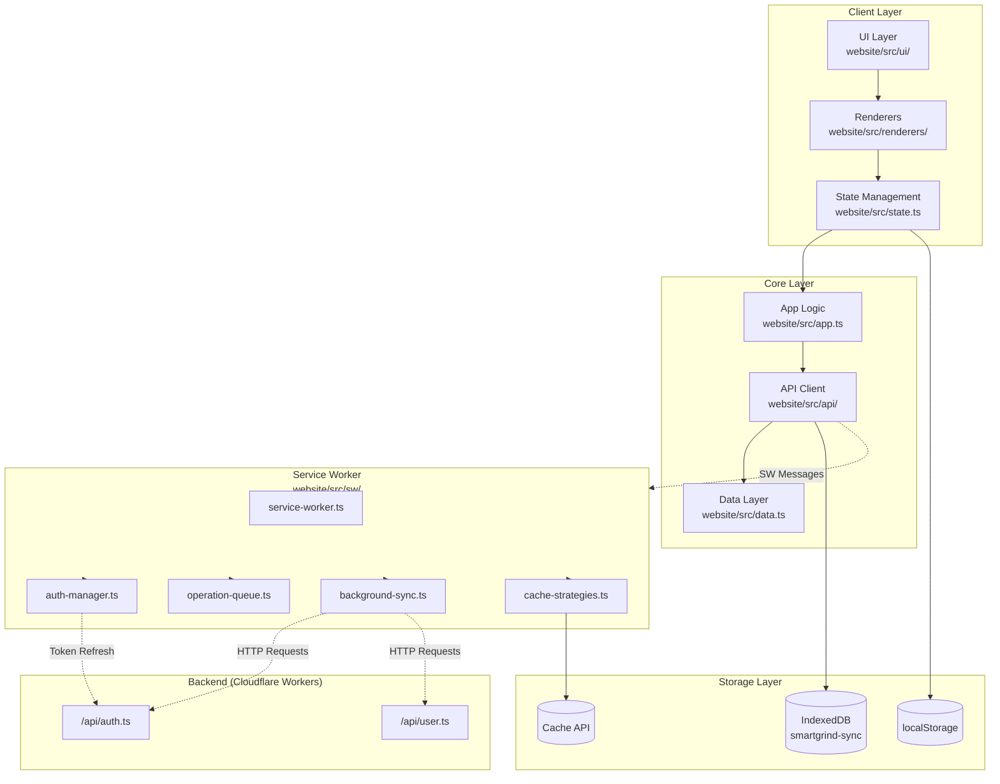
```mermaid
flowchart TB
    subgraph Client["Client Layer"]
        UI["UI Layer\nwebsite/src/ui/"]
        Renderers["Renderers\nwebsite/src/renderers/"]
        State["State Management\nwebsite/src/state.ts"]
    end

    subgraph Core["Core Layer"]
        App["App Logic\nwebsite/src/app.ts"]
        API["API Client\nwebsite/src/api/"]
        Data["Data Layer\nwebsite/src/data.ts"]
    end

    subgraph Storage["Storage Layer"]
        LocalStorage[("localStorage")]
        IDB[("IndexedDB\nsmartgrind-sync")]
        Cache[("Cache API")]
    end

    subgraph SW["Service Worker\nwebsite/src/sw/"]
        SWMain["service-worker.ts"]
        AuthManager["auth-manager.ts"]
        OpQueue["operation-queue.ts"]
        BGSync["background-sync.ts"]
        CacheStrat["cache-strategies.ts"]
    end

    subgraph Backend["Backend (Cloudflare Workers)"]
        AuthAPI["/api/auth.ts"]
        UserAPI["/api/user.ts"]
    end

    UI --> Renderers
    Renderers --> State
    State --> App
    App --> API
    API --> Data
    
    State --> LocalStorage
    API --> IDB
    
    API -.->|SW Messages| SW
    SW --> AuthManager
    SW --> OpQueue
    SW --> BGSync
    SW --> CacheStrat
    CacheStrat --> Cache
    
    BGSync -.->|HTTP Requests| AuthAPI
    BGSync -.->|HTTP Requests| UserAPI
    
    AuthManager -.->|Token Refresh| AuthAPI
```

### 2.2 Data Flow from UI to Persistence

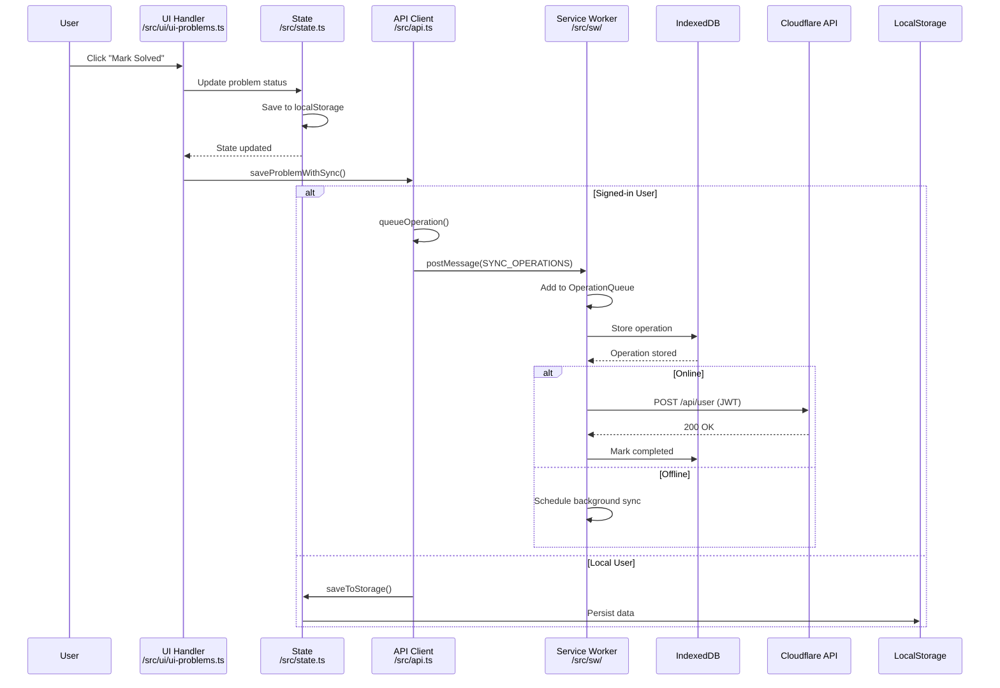
```mermaid
sequenceDiagram
    participant U as User
    participant UI as UI Handler<br/>/src/ui/ui-problems.ts
    participant S as State<br/>/src/state.ts
    participant API as API Client<br/>/src/api.ts
    participant SW as Service Worker<br/>/src/sw/
    participant IDB as IndexedDB
    participant Backend as Cloudflare API

    U->>UI: Click "Mark Solved"
    UI->>S: Update problem status
    S->>S: Save to localStorage
    S-->>UI: State updated
    UI->>API: saveProblemWithSync()
    
    alt Signed-in User
        API->>API: queueOperation()
        API->>SW: postMessage(SYNC_OPERATIONS)
        SW->>SW: Add to OperationQueue
        SW->>IDB: Store operation
        IDB-->>SW: Operation stored
        
        alt Online
            SW->>Backend: POST /api/user (JWT)
            Backend-->>SW: 200 OK
            SW->>IDB: Mark completed
        else Offline
            SW->>SW: Schedule background sync
        end
    else Local User
        API->>S: saveToStorage()
        S->>LocalStorage: Persist data
    end
```

### 2.3 Service Worker Interaction Flow

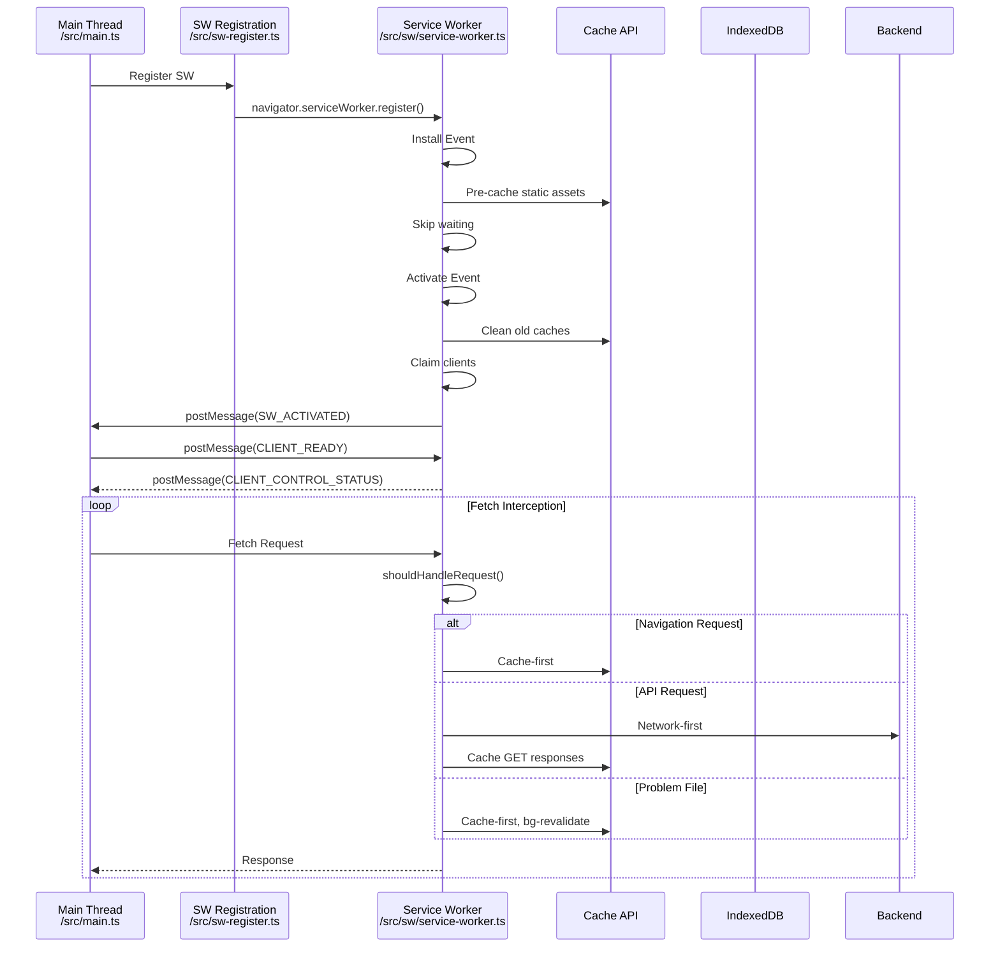
```mermaid
sequenceDiagram
    participant Main as Main Thread<br/>/src/main.ts
    participant Reg as SW Registration<br/>/src/sw-register.ts
    participant SW as Service Worker<br/>/src/sw/service-worker.ts
    participant Cache as Cache API
    participant IDB as IndexedDB

    Main->>Reg: Register SW
    Reg->>SW: navigator.serviceWorker.register()
    
    SW->>SW: Install Event
    SW->>Cache: Pre-cache static assets
    SW->>SW: Skip waiting
    
    SW->>SW: Activate Event
    SW->>Cache: Clean old caches
    SW->>SW: Claim clients
    SW->>Main: postMessage(SW_ACTIVATED)
    
    Main->>SW: postMessage(CLIENT_READY)
    SW-->>Main: postMessage(CLIENT_CONTROL_STATUS)
    
    loop Fetch Interception
        Main->>SW: Fetch Request
        SW->>SW: shouldHandleRequest()
        
        alt Navigation Request
            SW->>Cache: Cache-first
        else API Request
            SW->>Backend: Network-first
            SW->>Cache: Cache GET responses
        else Problem File
            SW->>Cache: Cache-first, bg-revalidate
        end
        
        SW-->>Main: Response
    end
```

### 2.4 Authentication Flow Sequence

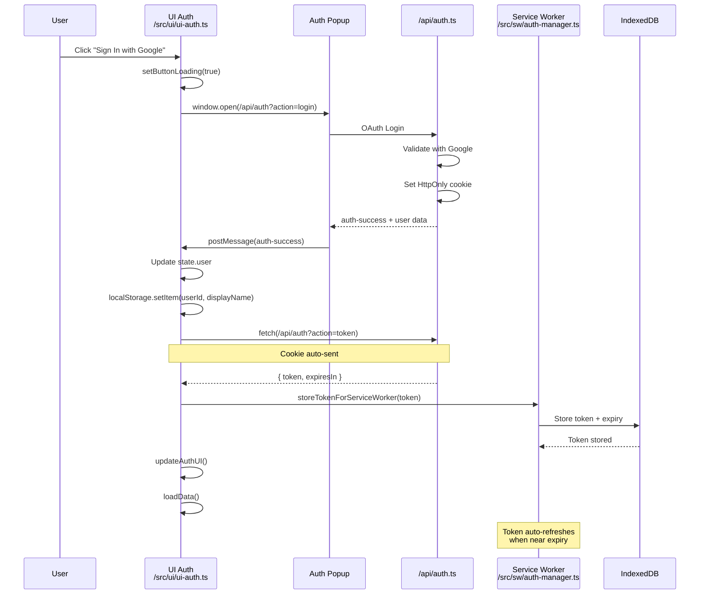
```mermaid
sequenceDiagram
    participant User
    participant UI as UI Auth<br/>/src/ui/ui-auth.ts
    participant Popup as Auth Popup
    participant BE as /api/auth.ts
    participant SW as Service Worker<br/>/src/sw/auth-manager.ts
    participant IDB as IndexedDB

    User->>UI: Click "Sign In with Google"
    UI->>UI: setButtonLoading(true)
    UI->>Popup: window.open(/api/auth?action=login)
    
    Popup->>BE: OAuth Login
    BE->>BE: Validate with Google
    BE->>BE: Set HttpOnly cookie
    BE-->>Popup: auth-success + user data
    
    Popup->>UI: postMessage(auth-success)
    
    UI->>UI: Update state.user
    UI->>UI: localStorage.setItem(userId, displayName)
    
    UI->>BE: fetch(/api/auth?action=token)
    Note over UI,BE: Cookie auto-sent
    BE-->>UI: { token, expiresIn }
    
    UI->>SW: storeTokenForServiceWorker(token)
    SW->>IDB: Store token + expiry
    IDB-->>SW: Token stored
    
    UI->>UI: updateAuthUI()
    UI->>UI: loadData()
    
    Note over SW: Token auto-refreshes<br/>when near expiry
```

### 2.5 API Request/Response Flow

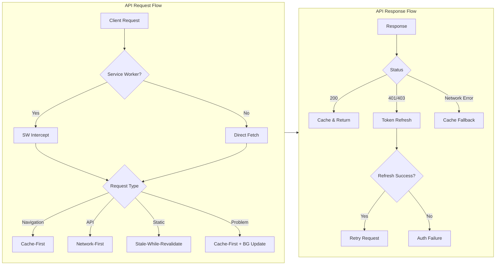
```mermaid
flowchart LR
    subgraph RequestFlow["API Request Flow"]
        A[Client Request] --> B{Service Worker?}
        B -->|Yes| C[SW Intercept]
        B -->|No| D[Direct Fetch]
        C --> E{Request Type}
        D --> E
        
        E -->|Navigation| F[Cache-First]
        E -->|API| G[Network-First]
        E -->|Static| H[Stale-While-Revalidate]
        E -->|Problem| I[Cache-First + BG Update]
    end
    
    subgraph ResponseFlow["API Response Flow"]
        J[Response] --> K{Status}
        K -->|200| L[Cache & Return]
        K -->|401/403| M[Token Refresh]
        K -->|Network Error| N[Cache Fallback]
        
        M --> O{Refresh Success?}
        O -->|Yes| P[Retry Request]
        O -->|No| Q[Auth Failure]
    end
    
    RequestFlow --> ResponseFlow
```

### 2.6 Component Hierarchy

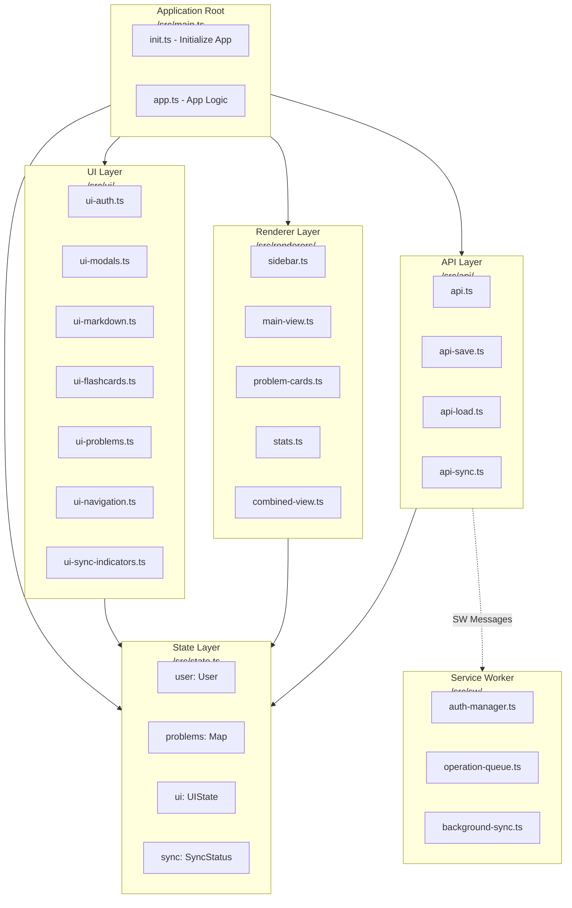
```mermaid
flowchart TB
    subgraph Root["Application Root<br/>/src/main.ts"]
        Init["init.ts - Initialize App"]
        App["app.ts - App Logic"]
    end
    
    subgraph StateLayer["State Layer<br/>/src/state.ts"]
        UserState["user: User"]
        ProblemState["problems: Map<string, Problem>"]
        UIState["ui: UIState"]
        SyncState["sync: SyncStatus"]
    end
    
    subgraph UILayer["UI Layer<br/>/src/ui/"]
        AuthUI["ui-auth.ts"]
        ModalUI["ui-modals.ts"]
        MarkdownUI["ui-markdown.ts"]
        FlashcardUI["ui-flashcards.ts"]
        ProblemUI["ui-problems.ts"]
        NavigationUI["ui-navigation.ts"]
        SyncUI["ui-sync-indicators.ts"]
    end
    
    subgraph RendererLayer["Renderer Layer<br/>/src/renderers/"]
        Sidebar["sidebar.ts"]
        MainView["main-view.ts"]
        ProblemCards["problem-cards.ts"]
        Stats["stats.ts"]
        CombinedView["combined-view.ts"]
    end
    
    subgraph APILayer["API Layer<br/>/src/api/"]
        APIMain["api.ts"]
        APISave["api-save.ts"]
        APILoad["api-load.ts"]
        APISync["api-sync.ts"]
    end
    
    Root --> StateLayer
    Root --> UILayer
    Root --> RendererLayer
    Root --> APILayer
    
    UILayer --> StateLayer
    RendererLayer --> StateLayer
    APILayer --> StateLayer
    
    APILayer -.->|SW Messages| SWLayer
    
    subgraph SWLayer["Service Worker<br/>/src/sw/"]
        SWAuth["auth-manager.ts"]
        SWQueue["operation-queue.ts"]
        SWBGSync["background-sync.ts"]
    end
```

### 2.7 State Management Propagation

The state management system uses a unidirectional data flow pattern. State changes originate from user actions or API responses, flow through action handlers that persist to storage, and emit custom events that trigger UI updates. This ensures all UI components remain synchronized with the central state while maintaining loose coupling between modules.

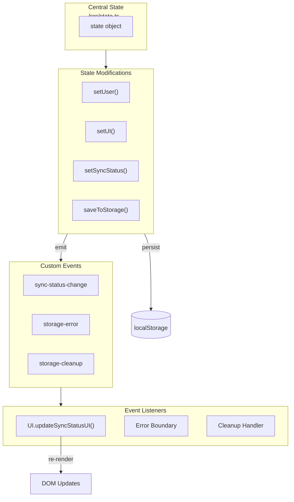
```mermaid
flowchart TB
    subgraph State["Central State<br/>/src/state.ts"]
        StateObj["state object"]
    end
    
    subgraph Actions["State Modifications"]
        SetUser["setUser()"]
        SetUI["setUI()"]
        SetSync["setSyncStatus()"]
        SaveStorage["saveToStorage()"]
    end
    
    subgraph Events["Custom Events"]
        SyncChange["sync-status-change"]
        StorageError["storage-error"]
        StorageCleanup["storage-cleanup"]
    end
    
    subgraph Listeners["Event Listeners"]
        UIUpdate["UI.updateSyncStatusUI()"]
        ErrorHandler["Error Boundary"]
        CleanupHandler["Cleanup Handler"]
    end
    
    State --> Actions
    Actions -->|persist| LocalStorage[(localStorage)]
    Actions -->|emit| Events
    
    Events --> Listeners
    
    UIUpdate -->|re-render| DOM[DOM Updates]
```

### 2.8 Deployment Architecture

SmartGrind is deployed on Cloudflare's edge network using Cloudflare Workers (Pages Functions).

#### 2.8.1 Infrastructure Overview

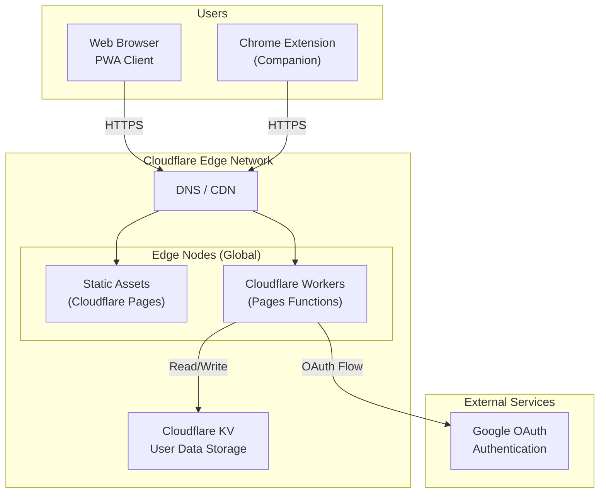
```mermaid
flowchart TB
    subgraph Users["Users"]
        Browser["Web Browser\nPWA Client"]
        Extension["Chrome Extension\n(Companion)"]
    end
    
    subgraph Cloudflare["Cloudflare Edge Network"]
        DNS["DNS / CDN"]
        
        subgraph EdgeNodes["Edge Nodes (Global)"]
            Static["Static Assets\n(Cloudflare Pages)"]
            Workers["Cloudflare Workers\n(Pages Functions)"]
        end
        
        KV["Cloudflare KV\nUser Data Storage"]
    end
    
    subgraph External["External Services"]
        Google["Google OAuth\nAuthentication"]
    end
    
    Browser -->|HTTPS| DNS
    Extension -->|HTTPS| DNS
    DNS --> Static
    DNS --> Workers
    Workers -->|Read/Write| KV
    Workers -->|OAuth Flow| Google
```

#### 2.8.2 Cloudflare Workers Architecture

| Component | Purpose | File |
|-----------|---------|------|
| **Pages Functions** | Serverless API endpoints | `website/functions/api/` |
| **Cloudflare KV** | Key-value data storage for user data | Namespace: `USER_DATA` |
| **Static Hosting** | Vite-built SPA static files | `website/dist/` |

#### 2.8.3 Request Flow

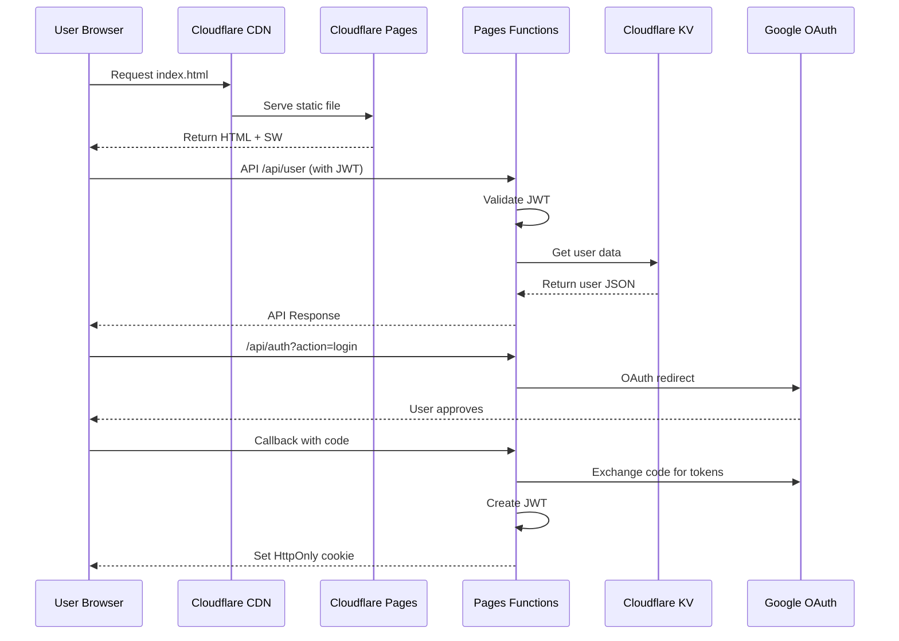
```mermaid
sequenceDiagram
    participant User as User Browser
    participant CDN as Cloudflare CDN
    participant Pages as Cloudflare Pages
    participant Functions as Pages Functions
    participant KV as Cloudflare KV
    participant Google as Google OAuth

    %% Static Content
    User->>CDN: Request index.html
    CDN->>Pages: Serve static file
    Pages-->>User: Return HTML + SW
    
    %% API Request
    User->>Functions: API /api/user (with JWT)
    Functions->>Functions: Validate JWT
    Functions->>KV: Get user data
    KV-->>Functions: Return user JSON
    Functions-->>User: API Response
    
    %% Authentication
    User->>Functions: /api/auth?action=login
    Functions->>Google: OAuth redirect
    Google-->>User: User approves
    User->>Functions: Callback with code
    Functions->>Google: Exchange code for tokens
    Functions->>Functions: Create JWT
    Functions-->>User: Set HttpOnly cookie
```

#### 2.8.4 Environment Configuration

| Variable | Purpose | Location |
|----------|---------|----------|
| `JWT_SECRET` | Token signing secret | Cloudflare Secrets |
| `GOOGLE_CLIENT_ID` | OAuth client ID | Cloudflare Secrets |
| `GOOGLE_CLIENT_SECRET` | OAuth client secret | Cloudflare Secrets |
| `KV_NAMESPACE_ID` | User data storage binding | wrangler.toml |
| `API_BASE_URL` | Backend API base path | vite.config.ts |

#### 2.8.5 Build and Deployment Pipeline

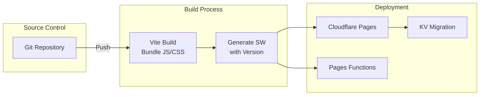
```mermaid
flowchart LR
    subgraph Source["Source Control"]
        Git["Git Repository"]
    end
    
    subgraph Build["Build Process"]
        Vite["Vite Build\nBundle JS/CSS"]
        SW["Generate SW\nwith Version"]
    end
    
    subgraph Deploy["Deployment"]
        PagesDeploy["Cloudflare Pages"]
        FunctionsDeploy["Pages Functions"]
        KVDeploy["KV Migration"]
    end
    
    Git -->|Push| Vite
    Vite --> SW
    SW --> PagesDeploy
    SW --> FunctionsDeploy
    PagesDeploy --> KVDeploy
```

**Build Steps:**
1. `npm run build` - Vite bundles frontend assets
2. Service Worker version injected at build time (`__SW_VERSION_PLACEHOLDER__`)
3. Static assets uploaded to Cloudflare Pages
4. Functions deployed to edge nodes
5. Cache invalidation triggers clients to update

---

## 3. API Contracts

### 3.1 Authentication Endpoints

#### 3.1.1 OAuth Login Initiation

| Field | Value |
|-------|-------|
| **Endpoint** | `/smartgrind/api/auth?action=login` |
| **Method** | `GET` |
| **Response Type** | `text/html` (OAuth redirect) |

**Flow:**
1. Client opens popup to this endpoint
2. Server redirects to Google OAuth
3. Google redirects back with code
4. Server exchanges code for tokens
5. Server sets HttpOnly cookie with JWT
6. Server returns HTML with `postMessage` to opener

#### 3.1.2 Token Retrieval

| Field | Value |
|-------|-------|
| **Endpoint** | `/smartgrind/api/auth?action=token` |
| **Method** | `GET` |
| **Credentials** | `include` (sends HttpOnly cookie) |
| **Response** | `application/json` |

**Response Schema:**
```typescript
interface TokenResponse {
    token: string;           // JWT access token
    userId: string;          // User ID
    displayName: string;     // User display name
    expiresIn: number;       // Token lifetime in seconds
}
```

#### 3.1.3 Logout

| Field | Value |
|-------|-------|
| **Endpoint** | `/smartgrind/api/auth?action=logout` |
| **Method** | `GET` |
| **Response** | Redirect to homepage |

### 3.2 User Data Endpoints

#### 3.2.1 Load User Data

| Field | Value |
|-------|-------|
| **Endpoint** | `/smartgrind/api/user` |
| **Method** | `GET` |
| **Auth** | Bearer Token or HttpOnly Cookie |
| **Response** | `application/json` |

**Response Schema:**
```typescript
interface LoadUserDataResponse {
    problems: Record<string, Problem>;  // Problem ID → Problem
    deletedIds: string[];               // Array of deleted problem IDs
    flashCardProgress?: Record<string, FlashCardProgress>;
}
```

#### 3.2.2 Save User Data

| Field | Value |
|-------|-------|
| **Endpoint** | `/smartgrind/api/user` |
| **Method** | `POST` |
| **Auth** | Bearer Token or HttpOnly Cookie |
| **Content-Type** | `application/json` or `application/octet-stream` (compressed) |
| **Response** | `application/json` |

**Request Schema (Uncompressed):**
```typescript
interface SaveUserDataRequest {
    problems: Record<string, Problem>;
    deletedIds: string[];
    operations?: APIOperation[];  // Pending operations to sync
}
```

**Request Schema (Compressed):**
```typescript
// Body is compressed using CompressionStream
// Header: X-Compressed: true
```

**Response Schema:**
```typescript
interface SaveUserDataResponse {
    success: boolean;
    message?: string;
    conflicts?: ServerConflict[];
    serverTimestamp: number;
}
```

### 3.3 Operation Types

All sync operations follow this schema:

```typescript
interface APIOperation {
    type: APIOperationType;
    data: unknown;
    timestamp: number;
}

type APIOperationType = 
    | 'MARK_SOLVED'
    | 'UPDATE_REVIEW_DATE' 
    | 'UPDATE_DIFFICULTY'
    | 'ADD_NOTE'
    | 'ADD_CUSTOM_PROBLEM'
    | 'DELETE_PROBLEM'
    | 'UPDATE_SETTINGS';
```

#### 3.3.1 MARK_SOLVED

```typescript
interface MarkSolvedData {
    problemId: string;
    status: 'solved' | 'unsolved';
    timestamp: number;
}
```

#### 3.3.2 UPDATE_REVIEW_DATE

```typescript
interface UpdateReviewDateData {
    problemId: string;
    nextReviewDate: string | null;  // ISO date string
    reviewInterval: number;
    timestamp: number;
}
```

#### 3.3.3 UPDATE_DIFFICULTY

```typescript
interface UpdateDifficultyData {
    problemId: string;
    difficulty: 'easy' | 'medium' | 'hard';
    timestamp: number;
}
```

#### 3.3.4 ADD_NOTE

```typescript
interface AddNoteData {
    problemId: string;
    note: string;
    timestamp: number;
}
```

#### 3.3.5 ADD_CUSTOM_PROBLEM

```typescript
interface AddCustomProblemData {
    id: string;
    name: string;
    url: string;
    topic: string;
    pattern: string;
    timestamp: number;
}
```

#### 3.3.6 DELETE_PROBLEM

```typescript
interface DeleteProblemData {
    problemId: string;
    timestamp: number;
}
```

#### 3.3.7 UPDATE_SETTINGS

```typescript
interface UpdateSettingsData {
    preferredAI?: string;
    reviewDateFilter?: string;
    [key: string]: unknown;
}
```

### 3.4 Error Codes

The API uses standard HTTP status codes with structured error responses.

#### HTTP Status Codes

| Status | Meaning | Description |
|--------|---------|-------------|
| 200 | OK | Request succeeded |
| 201 | Created | Resource created successfully |
| 204 | No Content | Request succeeded, no response body |
| 400 | Bad Request | Invalid request parameters |
| 401 | Unauthorized | Authentication required or token expired |
| 403 | Forbidden | Insufficient permissions |
| 404 | Not Found | Resource not found |
| 409 | Conflict | Data conflict (e.g., concurrent modification) |
| 429 | Too Many Requests | Rate limit exceeded |
| 500 | Internal Server Error | Server-side error |
| 503 | Service Unavailable | Service temporarily unavailable |

#### Error Response Schema

```typescript
interface APIErrorResponse {
    error: string;          // Error code/machine-readable identifier
    message: string;        // Human-readable error description
    details?: unknown;      // Additional error context (optional)
    requestId?: string;     // Request ID for tracking
}
```

#### Common Error Codes

| Error Code | HTTP Status | Description |
|------------|-------------|-------------|
| `INVALID_TOKEN` | 401 | JWT token is invalid or malformed |
| `TOKEN_EXPIRED` | 401 | JWT token has expired |
| `AUTH_REQUIRED` | 401 | Authentication required for this endpoint |
| `INSUFFICIENT_PERMISSIONS` | 403 | User lacks required permissions |
| `RESOURCE_NOT_FOUND` | 404 | Requested resource does not exist |
| `VALIDATION_ERROR` | 400 | Request validation failed |
| `RATE_LIMIT_EXCEEDED` | 429 | Too many requests, retry after delay |
| `SYNC_CONFLICT` | 409 | Data conflict during synchronization |
| `STORAGE_QUOTA_EXCEEDED` | 503 | Server storage limit reached |
| `INTERNAL_ERROR` | 500 | Unexpected server error |

### 3.5 Rate Limiting

API requests are rate-limited to ensure fair usage and service stability.

#### Rate Limits by Endpoint

| Endpoint Category | Limit | Window | Applies To |
|-------------------|-------|--------|------------|
| Authentication | 10 requests | 1 minute | `/smartgrind/api/auth/*` |
| User Data Read | 60 requests | 1 minute | `GET /smartgrind/api/user` |
| User Data Write | 30 requests | 1 minute | `POST /smartgrind/api/user` |
| Static Assets | 300 requests | 1 minute | CSS, JS, images |
| Problem Content | 120 requests | 1 minute | Markdown files |

#### Rate Limit Headers

All API responses include rate limit information:

| Header | Description |
|--------|-------------|
| `X-RateLimit-Limit` | Maximum requests allowed per window |
| `X-RateLimit-Remaining` | Remaining requests in current window |
| `X-RateLimit-Reset` | Unix timestamp when window resets |
| `Retry-After` | Seconds to wait before retry (on 429 only) |

#### Rate Limit Response (429)

```json
{
    "error": "RATE_LIMIT_EXCEEDED",
    "message": "Rate limit exceeded. Please slow down your requests.",
    "details": {
        "limit": 60,
        "window": "1m",
        "retryAfter": 45
    }
}
```

---

## 4. Data Models

### 4.1 Problem Entity

**File:** `website/src/types.ts`

```typescript
interface Problem {
    // Identity
    id: string;                    // Unique identifier (e.g., "two-sum", "sql-join-101")
    name: string;                  // Display name
    url: string;                   // LeetCode/Problem URL
    
    // State
    status: 'unsolved' | 'solved'; // Completion status
    topic: string;                 // Topic/category (e.g., "Arrays", "SQL Joins")
    pattern: string;               // Pattern name (e.g., "Two Pointers")
    
    // Spaced Repetition
    reviewInterval: number;        // Index into SPACED_REPETITION_INTERVALS
    nextReviewDate: string | null; // ISO date string (YYYY-MM-DD)
    
    // Notes
    note: string;                  // User notes (sanitized)
    
    // Transient UI State (not persisted)
    loading?: boolean;             // Currently syncing
    noteVisible?: boolean;         // Note editor visible
}

// Spaced Repetition Intervals (days)
const SPACED_REPETITION_INTERVALS = [1, 3, 7, 14, 30, 60, 90];
```

### 4.2 User Entity

**File:** `website/src/types.ts`

```typescript
interface User {
    type: 'local' | 'signed-in';  // Account type
    id: string | null;            // User ID (null for local)
    displayName: string;          // Display name
}

interface UserData {
    problems: Record<string, Problem>;  // All user problems
    deletedIds: string[];               // Deleted problem IDs
}
```

### 4.3 FlashCard Entity

**File:** `website/src/types.ts`

```typescript
interface FlashCard {
    // Identity
    id: string;                    // Unique card ID
    type: 'algorithm' | 'pattern' | 'sql';  // Content type
    category: string;              // Algorithm category or Pattern topic ID
    
    // Content
    front: string;                 // Question/Front side (Markdown)
    back: string;                  // Answer/Back side (Markdown)
    
    // Metadata
    difficulty: 'easy' | 'medium' | 'hard';
    tags: string[];                // Searchable tags
}

interface FlashCardProgress {
    cardId: string;                // Reference to FlashCard
    reviewInterval: number;        // Index into intervals
    nextReviewDate: string | null;  // ISO date
    timesReviewed: number;         // Total reviews
    timesCorrect: number;          // Successful recalls
    lastReviewedAt: string | null; // ISO timestamp
}

interface FlashCardSession {
    cardIds: string[];             // Cards in session
    currentIndex: number;          // Current position
    categoryFilter: string | null; // Category filter
    typeFilter: 'all' | 'algorithm' | 'pattern' | 'sql';
    modeFilter: 'all' | 'due';     // All cards or due only
    startedAt: string;             // ISO timestamp
}
```

### 4.4 Sync Operation Entity

**File:** `website/src/sw/operation-queue.ts`

```typescript
type OperationType = 
    | 'MARK_SOLVED'
    | 'UPDATE_REVIEW_DATE'
    | 'UPDATE_DIFFICULTY'
    | 'ADD_NOTE'
    | 'ADD_CUSTOM_PROBLEM'
    | 'DELETE_PROBLEM'
    | 'UPDATE_SETTINGS';

interface QueuedOperation {
    // Identity
    id: string;                    // Unique operation ID (timestamp-random)
    type: OperationType;            // Operation type
    
    // Data
    data: unknown;                // Operation-specific payload
    timestamp: number;            // Creation timestamp
    deviceId: string;             // Originating device
    
    // Execution State
    retryCount: number;           // Failed retry attempts
    status: 'pending' | 'completed' | 'failed' | 'manual-resolution';
    errorMessage?: string;        // Failure reason
    
    // Metadata
    createdAt: number;            // Creation timestamp (indexed)
}

interface SyncStats {
    pending: number;              // Pending operations
    completed: number;            // Successfully synced
    failed: number;               // Failed operations
    manual: number;               // Need manual resolution
}
```

### 4.5 Entity Relationships

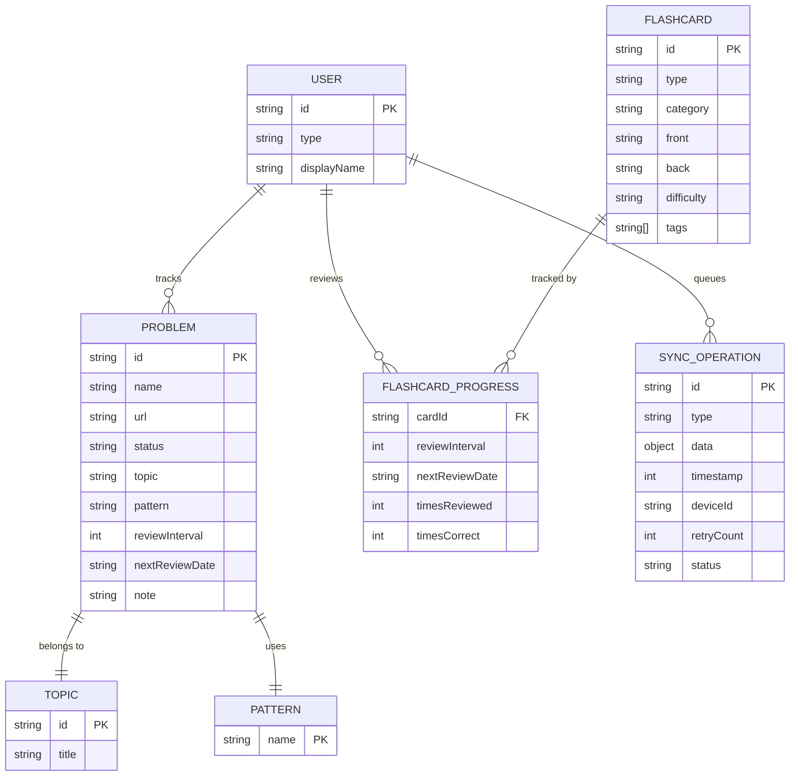
```mermaid
erDiagram
    USER ||--o{ PROBLEM : "tracks"
    USER ||--o{ FLASHCARD_PROGRESS : "reviews"
    PROBLEM ||--|| TOPIC : "belongs to"
    PROBLEM ||--|| PATTERN : "uses"
    USER ||--o{ SYNC_OPERATION : "queues"
    FLASHCARD ||--o{ FLASHCARD_PROGRESS : "tracked by"
    
    USER {
        string id PK
        string type
        string displayName
    }
    
    PROBLEM {
        string id PK
        string name
        string url
        string status
        string topic
        string pattern
        int reviewInterval
        string nextReviewDate
        string note
    }
    
    FLASHCARD {
        string id PK
        string type
        string category
        string front
        string back
        string difficulty
        string[] tags
    }
    
    FLASHCARD_PROGRESS {
        string cardId FK
        int reviewInterval
        string nextReviewDate
        int timesReviewed
        int timesCorrect
    }
    
    SYNC_OPERATION {
        string id PK
        string type
        object data
        int timestamp
        string deviceId
        int retryCount
        string status
    }
    
    TOPIC {
        string id PK
        string title
    }
    
    PATTERN {
        string name PK
    }
```

---

## 5. Frontend Component Hierarchy

### 5.1 UI Module Structure

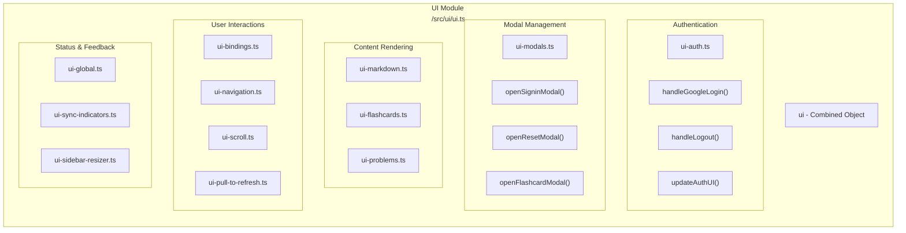
```mermaid
flowchart TB
    subgraph UIModule["UI Module<br/>/src/ui/ui.ts"]
        direction TB
        
        UI["ui - Combined Object"]
        
        subgraph Auth["Authentication"]
            AuthUI["ui-auth.ts"]
            Login["handleGoogleLogin()"]
            Logout["handleLogout()"]
            Update["updateAuthUI()"]
        end
        
        subgraph Modals["Modal Management"]
            ModalUI["ui-modals.ts"]
            Signin["openSigninModal()"]
            Reset["openResetModal()"]
            Flashcard["openFlashcardModal()"]
        end
        
        subgraph Content["Content Rendering"]
            Markdown["ui-markdown.ts"]
            Flashcards["ui-flashcards.ts"]
            Problems["ui-problems.ts"]
        end
        
        subgraph Interactions["User Interactions"]
            Bindings["ui-bindings.ts"]
            Navigation["ui-navigation.ts"]
            Scroll["ui-scroll.ts"]
            PullToRefresh["ui-pull-to-refresh.ts"]
        end
        
        subgraph Status["Status & Feedback"]
            Global["ui-global.ts"]
            Sync["ui-sync-indicators.ts"]
            Sidebar["ui-sidebar-resizer.ts"]
        end
    end
```

### 5.2 Renderer Module Structure

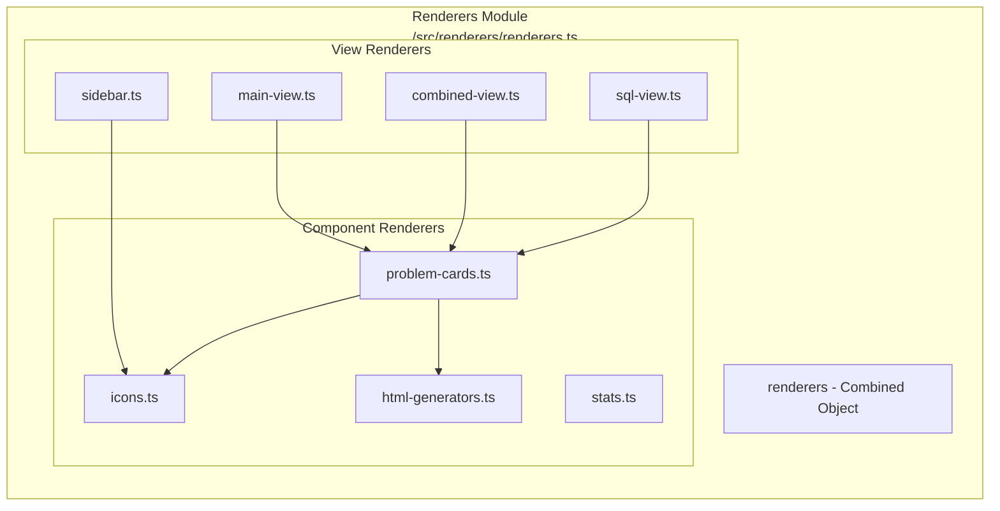
```mermaid
flowchart TB
    subgraph Renderers["Renderers Module<br/>/src/renderers/renderers.ts"]
        direction TB
        
        R["renderers - Combined Object"]
        
        subgraph Views["View Renderers"]
            Main["main-view.ts"]
            Combined["combined-view.ts"]
            SQL["sql-view.ts"]
            Sidebar["sidebar.ts"]
        end
        
        subgraph Components["Component Renderers"]
            Cards["problem-cards.ts"]
            Stats["stats.ts"]
            HTMLGen["html-generators.ts"]
            Icons["icons.ts"]
        end
    end
    
    Main --> Cards
    Combined --> Cards
    SQL --> Cards
    Sidebar --> Icons
    Cards --> HTMLGen
    Cards --> Icons
```

### 5.3 State Management Flow

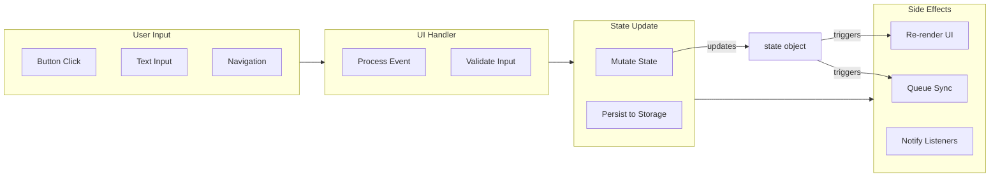
```mermaid
flowchart LR
    subgraph Input["User Input"]
        Click["Button Click"]
        Type["Text Input"]
        Navigate["Navigation"]
    end
    
    subgraph Handler["UI Handler"]
        Process["Process Event"]
        Validate["Validate Input"]
    end
    
    subgraph StateUpdate["State Update"]
        Mutate["Mutate State"]
        Persist["Persist to Storage"]
    end
    
    subgraph Effects["Side Effects"]
        Sync["Queue Sync"]
        Render["Re-render UI"]
        Notify["Notify Listeners"]
    end
    
    Input --> Handler
    Handler --> StateUpdate
    StateUpdate --> Effects
    
    Mutate -->|updates| State["state object"]
    State -->|triggers| Render
    State -->|triggers| Sync
```

---

## 6. Middleware Pipeline

### 6.1 Service Worker Fetch Handling Pipeline

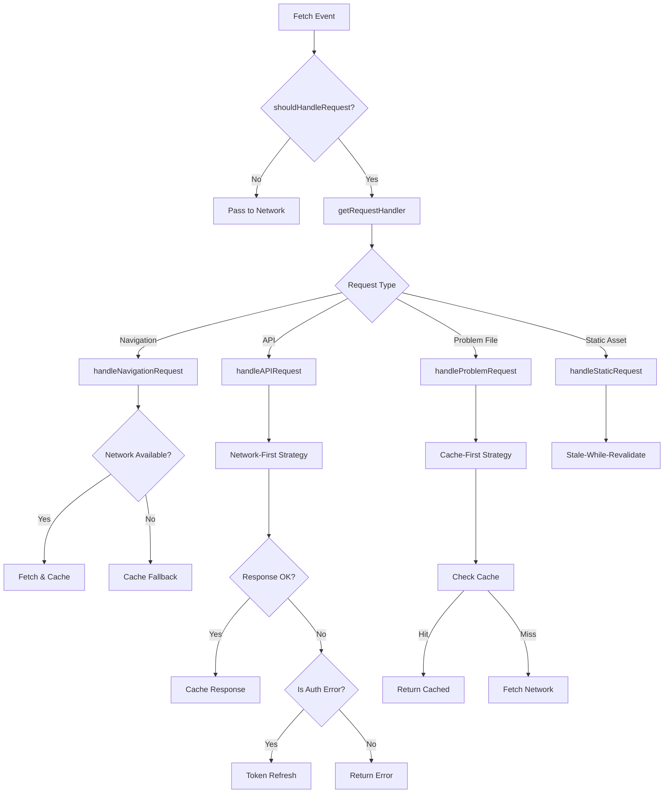
```mermaid
flowchart TD
    A[Fetch Event] --> B{shouldHandleRequest?}
    B -->|No| C[Pass to Network]
    B -->|Yes| D[getRequestHandler]
    
    D --> E{Request Type}
    
    E -->|Navigation| F[handleNavigationRequest]
    E -->|API| G[handleAPIRequest]
    E -->|Problem File| H[handleProblemRequest]
    E -->|Static Asset| I[handleStaticRequest]
    
    F --> J{Network Available?}
    G --> K[Network-First Strategy]
    H --> L[Cache-First Strategy]
    I --> M[Stale-While-Revalidate]
    
    J -->|Yes| N[Fetch & Cache]
    J -->|No| O[Cache Fallback]
    
    K --> P{Response OK?}
    P -->|Yes| Q[Cache Response]
    P -->|No| R{Is Auth Error?}
    
    R -->|Yes| S[Token Refresh]
    R -->|No| T[Return Error]
    
    L --> U[Check Cache]
    U -->|Hit| V[Return Cached]
    U -->|Miss| W[Fetch Network]
```

### 6.2 API Request Middleware Pipeline

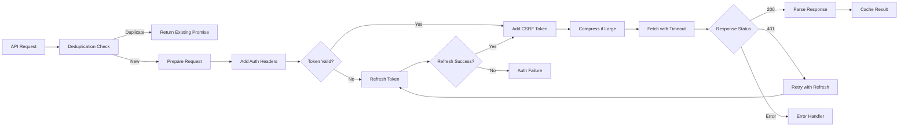
```mermaid
flowchart LR
    A[API Request] --> B[Deduplication Check]
    B -->|Duplicate| C[Return Existing Promise]
    B -->|New| D[Prepare Request]
    
    D --> E[Add Auth Headers]
    E --> F{Token Valid?}
    F -->|No| G[Refresh Token]
    F -->|Yes| H[Add CSRF Token]
    
    G --> I{Refresh Success?}
    I -->|Yes| H
    I -->|No| J[Auth Failure]
    
    H --> K[Compress if Large]
    K --> L[Fetch with Timeout]
    
    L --> M{Response Status}
    M -->|200| N[Parse Response]
    M -->|401| O[Retry with Refresh]
    M -->|Error| P[Error Handler]
    
    N --> Q[Cache Result]
    O --> G
```

### 6.3 Authentication Middleware Pipeline

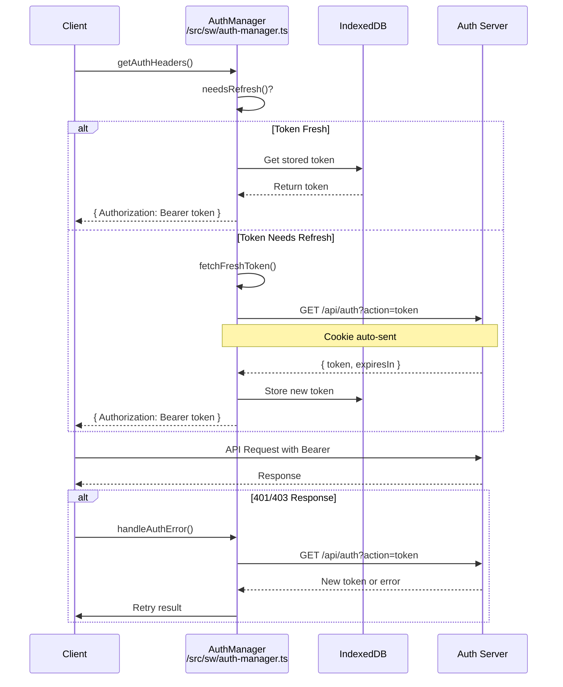
```mermaid
sequenceDiagram
    participant Client
    participant AuthManager as AuthManager<br/>/src/sw/auth-manager.ts
    participant IDB as IndexedDB
    participant Server as Auth Server

    Client->>AuthManager: getAuthHeaders()
    AuthManager->>AuthManager: needsRefresh()?
    
    alt Token Fresh
        AuthManager->>IDB: Get stored token
        IDB-->>AuthManager: Return token
        AuthManager-->>Client: { Authorization: Bearer token }
    else Token Needs Refresh
        AuthManager->>AuthManager: fetchFreshToken()
        AuthManager->>Server: GET /api/auth?action=token
        Note over AuthManager,Server: Cookie auto-sent
        Server-->>AuthManager: { token, expiresIn }
        AuthManager->>IDB: Store new token
        AuthManager-->>Client: { Authorization: Bearer token }
    end
    
    Client->>Server: API Request with Bearer
    Server-->>Client: Response
    
    alt 401/403 Response
        Client->>AuthManager: handleAuthError()
        AuthManager->>Server: GET /api/auth?action=token
        Server-->>AuthManager: New token or error
        AuthManager->>Client: Retry result
    end
```

---

## 7. Cross-Referenced Indexes

### 7.1 Module → Test File Mapping

| Source Module | Test File(s) | Coverage Area |
|---------------|--------------|---------------|
| `website/src/state.ts` | `website/tests/state.test.ts` | State management, storage |
| `website/src/api.ts` | `website/tests/api-core.test.ts`<br>`website/tests/api-offline.test.ts` | API coordination |
| `website/src/api/api-save.ts` | `website/tests/api/api-save.test.ts`<br>`website/tests/api/api-save-extended.test.ts` | Save operations |
| `website/src/sw/service-worker.ts` | `website/tests/sw/service-worker.test.ts` | SW lifecycle |
| `website/src/sw/auth-manager.ts` | `website/tests/sw/auth-manager.test.ts` | Token management |
| `website/src/sw/operation-queue.ts` | `website/tests/sw/operation-queue.test.ts` | Operation queue |
| `website/src/sw/background-sync.ts` | `website/tests/sw/background-sync.test.ts` | Background sync |
| `website/src/sw/sw-messaging.ts` | `website/tests/sw/sw-messaging.test.ts` | SW communication |
| `website/src/sw/offline-manager.ts` | `website/tests/sw/offline-manager.test.ts` | Offline caching |
| `website/src/sw/cache-strategies.ts` | `website/tests/sw/cache-strategies.test.ts`<br>`website/tests/sw/cache-strategies-comprehensive.test.ts` | Caching strategies |
| `website/src/ui/ui-markdown.ts` | `website/tests/ui-markdown.test.ts`<br>`website/tests/ui-markdown-comprehensive.test.ts` | Markdown rendering |
| `website/src/ui/ui-sync-indicators.ts` | `website/tests/ui-sync-indicators.test.ts` | Sync UI |
| `website/src/utils-core.ts` | `website/tests/utils-core.test.ts` | Core utilities |
| `website/src/error-boundary.ts` | `website/tests/error-boundary.test.ts` | Error handling |
| `website/src/init.ts` | `website/tests/init.test.ts` | Initialization |
| `website/src/data.ts` | `website/tests/data.test.ts` | Data layer |
| `website/src/sanitization.ts` | `website/tests/sanitization.test.ts` | Input sanitization |
| `website/src/sw-auth-storage.ts` | `website/tests/sw-auth-storage.test.ts` | SW auth storage |
| `website/src/sw/sync-conflict-resolver.ts` | `website/tests/sw/sync-conflict-resolver.test.ts` | Conflict resolution |
| `website/src/sw/sync-scheduler.ts` | `website/tests/sw/sync-scheduler.test.ts` | Sync scheduling |

### 7.2 Feature → Implementation File Mapping

| Feature | Implementation Files |
|---------|---------------------|
| **Authentication** | `website/src/ui/ui-auth.ts`<br>`website/src/sw/auth-manager.ts`<br>`website/functions/api/auth.ts` |
| **Problem Tracking** | `website/src/state.ts`<br>`website/src/api/api-save.ts`<br>`website/src/renderers/problem-cards.ts`<br>`website/src/ui/ui-problems.ts` |
| **Spaced Repetition** | `website/src/types.ts`<br>`website/src/data/flashcards-data.ts`<br>`website/src/ui/ui-flashcards.ts` |
| **Offline Support** | `website/src/sw/service-worker.ts`<br>`website/src/sw/offline-manager.ts`<br>`website/src/sw/background-sync.ts` |
| **Sync & Conflict Resolution** | `website/src/api.ts`<br>`website/src/sw/operation-queue.ts`<br>`website/src/sw/sync-conflict-resolver.ts`<br>`website/src/sw/sync-scheduler.ts` |
| **Markdown Rendering** | `website/src/ui/ui-markdown.ts`<br>`website/src/renderers/html-generators.ts` |
| **Data Persistence** | `website/src/state.ts`<br>`website/src/utils-core.ts`<br>`website/src/utils/indexeddb-helper.ts` |
| **Error Handling** | `website/src/error-boundary.ts`<br>`website/src/utils/error-tracker.ts` |
| **Modal System** | `website/src/ui/ui-modals.ts` |
| **Navigation** | `website/src/ui/ui-navigation.ts`<br>`website/src/renderers/sidebar.ts` |
| **Statistics** | `website/src/renderers/stats.ts`<br>`website/src/app.ts` |
| **Search & Filter** | `website/src/state.ts`<br>`website/src/renderers/main-view.ts` |
| **Pull-to-Refresh** | `website/src/ui/ui-pull-to-refresh.ts` |
| **Bundle Download** | `website/src/sw/service-worker.ts` (lines 1220-1500+) |

### 7.3 Configuration → Usage Mapping

| Configuration File | Configuration Values | Usage Locations |
|-------------------|---------------------|-----------------|
| `website/src/config/sync-config.ts` | `SYNC_CONFIG` | `website/src/api.ts`<br>`website/src/sw/background-sync.ts`<br>`website/src/sw/sync-scheduler.ts` |
| `website/src/config/idb-config.ts` | IndexedDB schemas | `website/src/utils/indexeddb-helper.ts`<br>`website/src/sw/operation-queue.ts`<br>`website/src/sw/auth-manager.ts` |
| `website/src/ui/ui-constants.ts` | `UI_CONSTANTS` | All UI modules |
| `website/src/sw/cache-strategies.ts` | `CACHE_NAMES` | All SW modules |
| `wrangler.toml` | Worker config | Cloudflare deployment |
| `vite.config.ts` | Build config | Build process |
| `tailwind.config.js` | Theme config | CSS generation |

---

## 8. Code Pattern Examples

### 8.1 Authentication Flow (OAuth → JWT → API Calls)

```typescript
// File: website/src/ui/ui-auth.ts
// Pattern: OAuth Popup → Token Exchange → Service Worker Storage

export const handleGoogleLogin = () => {
    // 1. Open OAuth popup
    const popup = window.open('/smartgrind/api/auth?action=login', 'auth', 'width=500,height=600');
    
    // 2. Listen for auth success message
    const messageHandler = async (event: MessageEvent) => {
        if (event.data.type === 'auth-success') {
            const { userId, displayName } = event.data;
            
            // 3. Store user info locally
            localStorage.setItem('userId', userId);
            localStorage.setItem('displayName', displayName);
            state.user = { type: 'signed-in', id: userId, displayName };
            
            // 4. Fetch JWT token for Service Worker
            const tokenResponse = await fetch('/smartgrind/api/auth?action=token', {
                credentials: 'include',  // Sends HttpOnly cookie
            });
            const { token } = await tokenResponse.json();
            
            // 5. Store token for SW access
            await storeTokenForServiceWorker(token);
            
            // 6. Load user data
            await api.loadData();
            updateAuthUI();
        }
    };
    
    window.addEventListener('message', messageHandler);
};
```

### 8.2 Error Handling (try/catch → errorTracker → UI)

```typescript
// File: website/src/api.ts
// Pattern: Operation → Error Capture → User Notification

export async function saveProblemWithSync(
    problemId: string,
    updates: Partial<Problem>
): Promise<void> {
    try {
        // 1. Local save
        await saveProblem();
        
        // 2. Queue for sync if signed in
        if (state.user.type === 'signed-in') {
            await queueOperation({
                type: 'MARK_SOLVED',
                data: { problemId, ...updates },
                timestamp: Date.now(),
            });
        }
    } catch (error) {
        // 3. Capture error with context
        errorTracker.captureException(error, {
            type: 'save_problem_failed',
            problemId,
            userType: state.user.type,
        });
        
        // 4. Show user-friendly error
        showToast('Failed to save progress. Please try again.', 'error');
        
        // 5. Re-throw for upstream handling
        throw error;
    }
}
```

### 8.3 Caching Mechanisms (Service Worker Strategies)

```typescript
// File: website/src/sw/service-worker.ts
// Pattern: Cache-First with Background Revalidation

async function handleProblemRequest(request: Request): Promise<Response> {
    const cache = await caches.open(`${CACHE_NAMES.PROBLEMS}-${CACHE_VERSION}`);
    
    // 1. Try cache first
    const cachedResponse = await cache.match(request);
    if (cachedResponse) {
        // 2. Revalidate in background (stale-while-revalidate)
        fetch(request)
            .then(networkResponse => {
                if (networkResponse.ok) {
                    cache.put(request, addCacheHeaders(networkResponse));
                }
            })
            .catch(() => {/* Silent fail - we're offline */});
        
        return cachedResponse;
    }
    
    // 3. Cache miss - fetch from network
    try {
        const networkResponse = await fetch(request);
        if (networkResponse.ok) {
            cache.put(request, networkResponse.clone());
        }
        return networkResponse;
    } catch (error) {
        // 4. Network failure - return offline fallback
        return new Response(
            '# Offline\n\nContent not available offline.',
            { status: 503, headers: { 'X-SW-Offline': 'true' } }
        );
    }
}
```

### 8.4 State Persistence (localStorage/IndexedDB)

```typescript
// File: website/src/state.ts
// Pattern: Debounced Save with Quota Handling

const STORAGE_SAVE_DELAY = 300;
let storageSaveTimeout: ReturnType<typeof setTimeout> | null = null;

export const state = {
    saveToStorage(options?: { silent?: boolean }): void {
        // 1. Debounce saves
        if (storageSaveTimeout) {
            clearTimeout(storageSaveTimeout);
        }
        
        storageSaveTimeout = setTimeout(() => {
            try {
                // 2. Prepare data (strip transient fields)
                const problemsWithoutLoading = Object.fromEntries(
                    [...this.problems.entries()].map(([id, { loading, noteVisible, ...rest }]) => [
                        id, rest
                    ])
                );
                
                // 3. Save to localStorage
                safeSetItem(keys.problems, problemsWithoutLoading);
                safeSetItem(keys.deletedIds, [...this.deletedProblemIds]);
                
                // 4. Clear any previous error
                this.storage.lastError = null;
            } catch (error) {
                // 5. Handle quota exceeded
                if (isQuotaExceededError(error)) {
                    this.storage.lastError = 'Storage quota exceeded';
                    this.storage.quotaExceeded = true;
                    
                    if (!options?.silent) {
                        this.emitStorageError('Storage full. Please sync your data.', true);
                    }
                }
            }
        }, STORAGE_SAVE_DELAY);
    },
};
```

---

## 9. Glossary

### 9.1 Domain Terms → File Paths

| Term | Definition | File Path |
|------|-----------|-----------|
| **Problem** | A coding problem or SQL question tracked by the user | `website/src/types.ts:4-16` |
| **Spaced Repetition** | Learning technique with increasing review intervals | `website/src/data.ts` |
| **FlashCard** | An algorithm/pattern card for active recall practice | `website/src/types.ts:91-99` |
| **Operation** | A pending data change queued for sync | `website/src/sw/operation-queue.ts:19-29` |
| **Service Worker** | Background script handling caching and sync | `website/src/sw/service-worker.ts` |
| **Sync Conflict** | Data discrepancy between client and server | `website/src/sw/sync-conflict-resolver.ts` |
| **Background Sync** | Deferred API calls when offline | `website/src/sw/background-sync.ts` |
| **HttpOnly Cookie** | Secure cookie inaccessible to JavaScript | `website/functions/api/auth.ts` |
| **JWT** | JSON Web Token for API authentication | `website/src/sw/auth-manager.ts` |
| **Local User** | Unauthenticated user with local-only data | `website/src/app.ts:30-75` |
| **Signed-in User** | Authenticated user with cloud sync | `website/src/ui/ui-auth.ts` |
| **Pattern** | Algorithmic pattern (Two Pointers, DP, etc.) | `website/src/types.ts:24-27` |
| **Topic** | Subject category (Arrays, SQL Joins, etc.) | `website/src/types.ts:29-33` |
| **Review Interval** | Days until next review (spaced repetition) | `website/src/types.ts:12` |
| **Cache-First** | SW strategy: serve from cache, fetch in background | `website/src/sw/service-worker.ts:533-604` |
| **Network-First** | SW strategy: try network, fallback to cache | `website/src/sw/service-worker.ts:452-526` |
| **Stale-While-Revalidate** | Serve cached, update cache asynchronously | `website/src/sw/service-worker.ts:609-666` |

### 9.2 Function Signatures for Key Operations

```typescript
// ============================================
// AUTHENTICATION
// ============================================

// website/src/ui/ui-auth.ts:60-165
function handleGoogleLogin(): void;

// website/src/ui/ui-auth.ts:172-205
function handleLogout(): Promise<void>;

// website/src/sw/auth-manager.ts:314-329
async function getToken(): Promise<string | null>;

// website/src/sw/auth-manager.ts:354-364
async function getAuthHeaders(): Promise<Record<string, string>>;

// ============================================
// STATE MANAGEMENT
// ============================================

// website/src/state.ts:140-196
function saveToStorage(options?: { silent?: boolean }): void;

// website/src/state.ts:113-134
function loadFromStorage(): void;

// website/src/state.ts:354-357
function setSyncStatus(status: Partial<SyncStatusUpdate>): void;

// website/src/state.ts:225-310
function freeStorageSpace(force?: boolean): number;

// ============================================
// API OPERATIONS
// ============================================

// website/src/api.ts:149-183
async function queueOperation(
    operation: APIOperation | APIOperation[]
): Promise<string | string[] | null>;

// website/src/api.ts:226-250
async function forceSync(): Promise<{ success: boolean; synced: number; failed: number }>;

// website/src/api/api-save.ts
async function saveProblem(
    problemId: string,
    updates: Partial<Problem>
): Promise<void>;

// website/src/api/api-load.ts
async function loadData(): Promise<void>;

// ============================================
// SERVICE WORKER
// ============================================

// website/src/sw/operation-queue.ts:142-180
async function addOperation(
    type: OperationType,
    data: unknown,
    options?: { deduplicate?: boolean; dedupeKey?: string }
): Promise<string>;

// website/src/sw/sw-messaging.ts
async function sendMessageToSW<T>(
    message: SWClientMessage,
    timeout?: number
): Promise<T>;

// website/src/sw/background-sync.ts
async function syncUserProgress(): Promise<{ success: boolean; synced: number; failed: number }>;

// website/src/sw/offline-manager.ts
async function cacheProblems(urls: string[]): Promise<{ cached: number; failed: number }>;

// ============================================
// RENDERING
// ============================================

// website/src/renderers/sidebar.ts
function renderSidebar(): void;

// website/src/renderers/combined-view.ts
function renderCombinedView(): void;

// website/src/renderers/problem-cards.ts
function renderProblemCard(problem: Problem, pattern: string): string;

// website/src/renderers/stats.ts
function updateStats(): void;

// ============================================
// UI HANDLERS
// ============================================

// website/src/ui/ui-modals.ts
function openSigninModal(): void;

// website/src/ui/ui-flashcards.ts
function startSession(options: SessionOptions): void;

// website/src/ui/ui-markdown.ts
async function renderMarkdown(url: string, container: HTMLElement): Promise<void>;

// website/src/ui/ui-global.ts
function showToast(message: string, type: 'success' | 'error' | 'info'): void;
```

### 9.3 Configuration Parameters

The following configuration constants control system behavior across various modules. These values are tuned for optimal user experience and resource utilization.

```typescript
// website/src/config/sync-config.ts
const SYNC_CONFIG = {
    MAX_RETRY_ATTEMPTS: 5,
    TIMEOUTS: {
        SYNC_BATCH: 60_000,           // 1 minute
        INDIVIDUAL_REQUEST: 15_000,  // 15 seconds
        SERVICE_WORKER_MESSAGE: 5_000, // 5 seconds
    },
    INTERVALS: {
        UPDATE_CHECK: 60 * 60 * 1000,  // 60 minutes
        SYNC_STATUS_POLL: 30_000,      // 30 seconds
    },
    BACKOFF: {
        BASE_DELAY: 1_000,   // 1 second
        MAX_DELAY: 60_000,   // 1 minute
        MULTIPLIER: 2,
    },
    CACHE: {
        PROBLEMS_MAX_AGE: 24 * 60 * 60 * 1000,  // 24 hours
        API_MAX_AGE: 5 * 60 * 1000,                // 5 minutes
        STATIC_MAX_AGE: 30 * 24 * 60 * 60 * 1000, // 30 days
    },
};

// website/src/sw/cache-strategies.ts
const CACHE_NAMES = {
    STATIC: 'smartgrind-static',
    PROBLEMS: 'smartgrind-problems',
    API: 'smartgrind-api',
};

// website/src/ui/ui-constants.ts
const UI_CONSTANTS = {
    AUTH_TIMEOUT: 120_000,     // 2 minutes
    SYNC_INDICATOR_DURATION: 3_000,  // 3 seconds
    DEBOUNCE_DELAY: 300,       // 300ms
    SCROLL_OFFSET: 80,       // pixels
};

// Spaced Repetition Intervals (days)
// website/src/data.ts
const SPACED_REPETITION_INTERVALS = [1, 3, 7, 14, 30, 60, 90];

// IndexedDB Configuration
// website/src/sw/operation-queue.ts
const DB_CONFIG = {
    DB_NAME: 'smartgrind-sync',
    DB_VERSION: 1,
    STORE_NAME: 'operation-queue',
};

// website/src/sw/auth-manager.ts
const AUTH_DB_CONFIG = {
    AUTH_DB_NAME: 'smartgrind-auth',
    AUTH_DB_VERSION: 1,
    AUTH_STORE_NAME: 'auth-tokens',
};
```

---

## Appendix A: File Size Limits and Constraints

| Resource | Limit | Location |
|----------|-------|----------|
| Max localStorage quota | ~5-10 MB | Browser-dependent |
| Max IndexedDB storage | Disk-dependent | `website/src/utils/indexeddb-helper.ts` |
| Max pending operations | 1000 | `website/src/api.ts:21` |
| Max string length (export) | 10,000 chars | `website/src/app.ts:19` |
| Export key length limit | 100 chars | `website/src/app.ts:21` |
| Storage save debounce | 300ms | `website/src/state.ts:17` |
| Deduplication window | 100ms | `website/src/api.ts:40` |
| Token refresh threshold | 5 minutes | `website/src/sw/auth-manager.ts:21` |
| API cache max age | 30 minutes | `website/src/sw/service-worker.ts:38` |
| Static cache max age | 24 hours | `website/src/sw/service-worker.ts:41` |

---

## Appendix B: Security Considerations

| Concern | Implementation | File |
|---------|---------------|------|
| XSS Prevention | DOMPurify sanitization | `website/src/ui/ui-markdown.ts` |
| Input Sanitization | Control character removal | `website/src/utils.ts` |
| CSRF Protection | Token validation | `website/src/utils/csrf.ts` |
| Auth Token Storage | IndexedDB (not localStorage) | `website/src/sw/auth-manager.ts` |
| Secure Cookies | HttpOnly, SameSite | `website/functions/api/auth.ts` |
| Secure Token Refresh | Cookie-based refresh | `website/src/sw/auth-manager.ts:259-308` |
| Export Sanitization | Key/value cleaning | `website/src/app.ts:81-98` |

---

## Appendix C: Data Migration Strategy

This appendix documents how user data migrates between different storage modes and versions.

### C.1 Local to Cloud Migration

When a local user signs in, their data is merged with any existing cloud data:

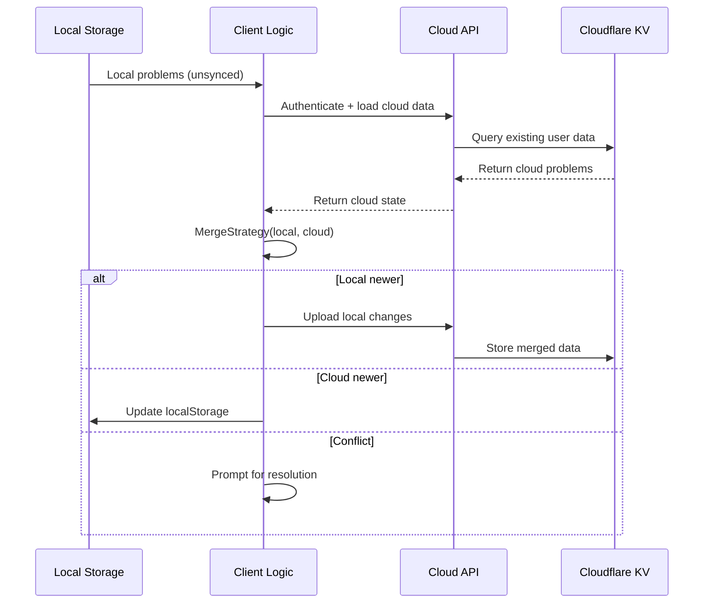
```mermaid
sequenceDiagram
    participant Local as Local Storage
    participant Client as Client Logic
    participant Cloud as Cloud API
    participant KV as Cloudflare KV

    Local->>Client: Local problems (unsynced)
    Client->>Cloud: Authenticate + load cloud data
    Cloud->>KV: Query existing user data
    KV-->>Cloud: Return cloud problems
    Cloud-->>Client: Return cloud state
    
    Client->>Client: MergeStrategy(local, cloud)
    
    alt Local newer
        Client->>Cloud: Upload local changes
        Cloud->>KV: Store merged data
    else Cloud newer
        Client->>Local: Update localStorage
    else Conflict
        Client->>Client: Prompt for resolution
    end
```

**Merge Rules:**
1. Compare `lastModified` timestamps on problems
2. Keep the most recently modified version
3. If same timestamp, prefer cloud version (server authoritative)
4. Conflicts on critical fields trigger manual resolution prompt

### C.2 Storage Schema Versions

| Version | Date | Changes | Migration Path |
|---------|------|---------|----------------|
| 1.0 | 2026-01 | Initial schema | N/A |
| 1.1 | 2026-03 | Added flashcard progress | Automatic - lazy migration on access |
| 1.2 | 2026-06 | Added `deletedIds` array | Automatic - runs on first sync |

### C.3 Browser Storage Migration

When localStorage approaches quota limits (~4.5MB warning):

1. **Automatic Cleanup** (if enabled):
   - Removes soft-deleted problem IDs older than 30 days
   - Archives old solved problems to IndexedDB
   - Keeps active/recent problems in localStorage

2. **Manual Export/Import**:
   ```typescript
   // Export data before clearing
   const exportData = {
       version: 1,
       exportedAt: Date.now(),
       problems: Object.fromEntries(state.problems),
       deletedIds: [...state.deletedProblemIds]
   };
   const json = JSON.stringify(exportData);
   // Download as file or copy to clipboard
   ```

3. **IndexedDB Fallback**:
   - Large datasets automatically move to IndexedDB
   - localStorage keeps only index/metadata
   - Transparent to user - same API

### C.4 Service Worker Cache Migration

When a new SW version activates:

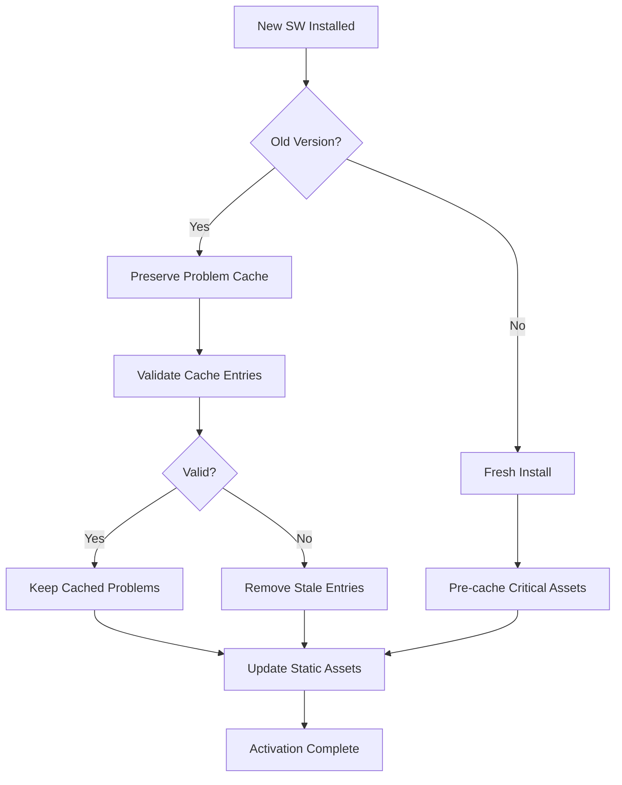
```mermaid
flowchart TD
    A[New SW Installed] --> B{Old Version?}
    B -->|Yes| C[Preserve Problem Cache]
    B -->|No| D[Fresh Install]
    
    C --> E[Validate Cache Entries]
    E --> F{Valid?}
    F -->|Yes| G[Keep Cached Problems]
    F -->|No| H[Remove Stale Entries]
    
    D --> I[Pre-cache Critical Assets]
    G --> J[Update Static Assets]
    H --> J
    I --> J
    J --> K[Activation Complete]
```

**Cache Migration Rules:**
- Problem content cache is preserved across updates
- Static assets get new versioned cache names
- Orphaned cache entries removed during activation
- Cache inventory tracked in IndexedDB (`smartgrind-sw-inventory`)


*End of Architecture Documentation*
